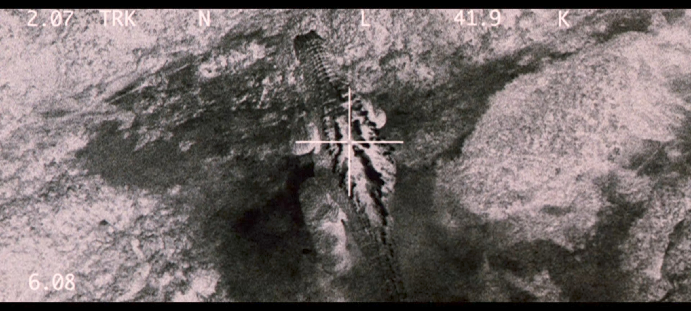

+++
title = "GMK: Giant Monsters All-Out Attack (2001)"

date = "2025-10-06"

description = "Godzilla fights Mothra and King Ghidora"

taxonomies.tags = [
    "backlog",
    "movies",
    "godzilla",
]

draft = false
+++

Surprisingly this was one of the more interesting Godzillas.

It included a lot of little stories, almost vignettes, in the beginning which was good for pacing.
For example

> a nurse in a hospital sees Godzilla approaching, thinks it's going to attack her building, then it pivots away... only to have his tail whip and knock the whole building over.

Which brings me to my next point: A lot of people very explicitly die in this movie!

It's very explicit like "That person died" not "That person got hurt, they'll come back in the third act for the credits."
So that's interesting.
