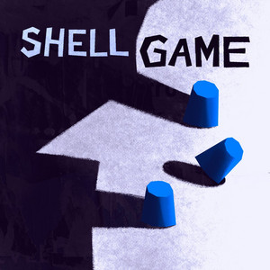

+++
title = "Shell game"
date = "2026-02-20"
description = "In which I start to make...... awkwardly long pauses......"
taxonomies.tags = ["podcast","backlog"]
draft = false
+++

Shell Game is a podcast about things that aren't what they seem, which in both cases are AI agents acting like real human people.
The show is funny and shocking with the hosts willingness to push things just a bit further than most people would for the sake of journalist rigor.

In Season 1 the host, Evan Ratliff, creates an AI "clone" of his voice and wires it up to receive phone calls.
He then plays the most chaotic neutral game ever: let the bot talk to customer service folks.
He escalates the game from there to scammers, work meetings, friends and family, and the entire time he's sharing these calls in podcast form of _his_ voice but _not him_ so you have to really listen to figure out if this is the robot Evan (it usually is) or real Evan.

One fun side-effect of listening to this show is that I am better at identifying the "tells" of a robo-voice.
Even if it sounds convincing and has responsive converstaions, the latency and "what a weird way to say a normal thing" word choice is a dead giveaway.
Of course tech is changing and my keen sense of what a robot sounds like will probably be out of date in like... a week.

The other side effect is that I have started to sound like the robot voice _just a little bit_.
It's like when you listen to an audiobook and start to think in the reader's voice; that happens to you too right?
Right?

I have finished Season 1.
I will update this post when I complete Season 2.