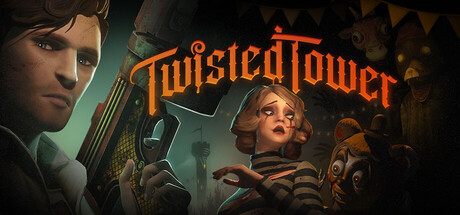

+++
title = "Twisted Tower"
date = "2026-08-22"
description = "A short and sweet Bioshock-like shooter"
taxonomies.tags = ["games", "backlog"]
+++

[Twisted Tower](https://store.steampowered.com/app/1575990/Twisted_Tower/) is a narrative mascot horror shooter game.
You work your way up a large theme park -- the Twisted Tower, around 5 levels and ~5-6 hours of gameplay.
Along the way you pick up whackey guns all of which feel _great_ to shoot, and you kill mascots all of which feel _great_ to shoot.

Everything mechanically works for this game.
The movement is fast and zippy, jumping is high, weapons are dolled out at a nice pace and movement upgrades like the grappling hook and double jump are only intended for certain areas but those are clearly telegraphed by the level design.

If you've played Bioshock you'll enjoy the moment to moment gameplay of Twisted Tower.
From the dark and unnervingly wet looking levels, to the arsenal of guns, to the letters and audio-logs, this is a love-letter to the Bioshock series and it does well.

I'm not a fan of the Mascot Horror genre, and the story of Twisted Tower does not quite live up to it's Bioshock-ey inspirations, but for $15 and only ~6 hours of playtime (we like this, we don't have _time_ for 60 hour stories) with New Game Plus features for additional play throughs, it's a totally fun way to spend a few nights.

I would say if you want a short, affordable, single player story game (wow that's my favorite genre who knew) you will enjoy Twisted Tower.
If you played Bioshock, you'll _really_ like Twisted Tower, but don't get your hopes up for a great story -- but that's ok!
Honestly I think a game can be great even with a mediocre story.