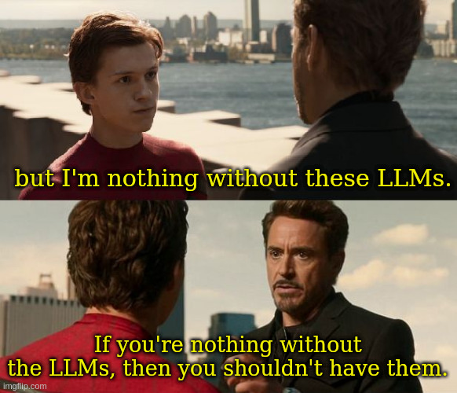

+++
title = "Generative AI Policy"
date = "2026-09-04"
description = "My personal AI usage policy"
taxonomies.tags = ["gen-ai"]
path = "/gen-ai-policy"
+++

> This is my personal Generative AI Policy.
> Unless otherwise specified, this policy applies to all content on this website, or the media this was linked alongside.

# 0. Scope of Policy

This policy promises limits on how much, if any, Generative AI is used in published creative works such as
* Blog posts
* Video games
* Websites
* Fiction
* Images
* Movies

You know... art.

# 1. Where Generative AI may be used

 Generative AI may be used in the following ways in the production of creative works:

1. As a resource for researching, reviewing, or architecting code.
2. Generating or refactoring tedious, time consuming, or error prone code.
3. Editing pros for written content like blog posts.

The guiding principle is "It gets me where I'm going, just faster".

# 2. Where Generative AI will not be used

Generative AI may *never* be used to generate shipped or placeholder art; including visual, audio, and written pros.

The guiding principle is "If you can't do it yourself, you shouldn't have an LLM do it for you".

# 3. Disclosure

Any time Generative AI is included in the final product in any way, that usage must be disclosed.
Disclosure should be specific as to what was generated. 

Example: *Generative AI was used to copy-edit this chapter*

