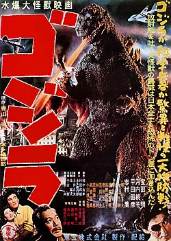
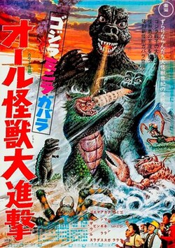

+++
title = "the Godzillas you should actually watch"
date = "2026-03-14"
description = "there are 38 Godzilla movies, whose to say which ones are worth watching? me. i am the whose that says."
taxonomies.tags = ["movies", "whats-good"]
+++

In 2025 I watched all 38 Godzilla movies with a group of friends. 
Each week we would watch the next one, in release order.
Every time I bring this up I stumble through recommending my favorites, so I'm writing it down.

This isn't a ranking of the top 5 Godzilla movies, but rather a curated viewing experience; if you watch these movies in this order you'll get the jist of what Godzilla was, has been, and is today.
Like a Cliff's Notes for the Godzilla universe. 

# 1. Godzilla (1954)

The first Godzilla isn't the best one by today's standards, but it does a great job of setting up the format and the production that most if the series has stuck with.
Humans do some dumb shit, some monster attacks (or Godzilla himself) and humans (or Godzilla) need to fight back.

It's a historically important film and honestly holds up well considering it's over 70 years old!

# 2. Godzilla: All Monsters Attack (1969)

After Godzilla there were a few more films that more or less solidified the formula.
They're fun but get repetitive after the 5th, 6th, 7th... you get it.

All Monsters Attack was unique in that it did play with the formula.
Unlike the previous entries which focus on big figures in Japan like governmental officials and mad scientists, this focuses on a little boy getting bullied and learning to stand up for himself.

It wasn't very well received at the time, and it's certainly not _better_ than the other entries at the time, but it is at least _different_ which I have to commend it for.

# 3. Godzilla Final War

# 4. Shin Godzilla

# 5. Godzilla Minus One

# Honorable Mentions

* Godzilla 1998
* Godzilla Anime Trilogy
* 