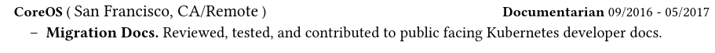

+++
title = "How I use typst"

date = "2025-07-17"

description = "Is typst objectively better than LaTeX? Maybe!"

taxonomies.tags = [
    "how i use",
    "typst",
]

aliases = ["/how-i-use-typst"]

draft = false
+++

This week I re-wrote [my resume](/Elijah%20Voigt.pdf)  in [typst](https://typst.app/).

[Old](old.pdf):


[New](new.pdf):


*Can you tell the difference? No? Excellent!*

Since graduating college I don't write a lot of LaTeX, but so far I prefer typst!

# 😧 typst is not (just) a better LaTeX

I posted some first impressions on [Bluesky](https://bsky.app/profile/elijah.run):

<blockquote class="bluesky-embed" data-bluesky-uri="at://did:plc:srziwhupeikb2bcnyndug2ga/app.bsky.feed.post/3ltx7vsqt3s2m" data-bluesky-cid="bafyreid2ol6s3bji2jkyiaxnwdgylql7qja72wojpnno5y2eohxahggswu" data-bluesky-embed-color-mode="system"><p lang="en">LaTeX being compatible with TeX makes it feel like the C++ of typesetting; a rich ecosystem with lots of bloat.

typst not being constrained in that way makes it feel like the Zig of typesetting; smaller ecosystem but a much smoother writing experience.</p>&mdash; Elijah Voigt (<a href="https://bsky.app/profile/did:plc:srziwhupeikb2bcnyndug2ga?ref_src=embed">@elijah.run</a>) <a href="https://bsky.app/profile/did:plc:srziwhupeikb2bcnyndug2ga/post/3ltx7vsqt3s2m?ref_src=embed">July 14, 2025 at 1:25 PM</a></blockquote><script async src="https://embed.bsky.app/static/embed.js" charset="utf-8"></script>

To elaborate: typst doesn't feel like an _improvement_ on LaTeX, it feels like a from-the-ground-up typsestter that learns from the past uhh -- wait [LaTeX](https://en.wikipedia.org/wiki/LaTeX) came out in 1984? and [TeX](https://en.wikipedia.org/wiki/TeX) came out in 1978?? So yeah it learns from the past 41+ years.

# 🧑‍💻 typst is just programming (for me)

To be fair, so is LaTeX.
If you give me a programming language I'm gonna program.

The typst docs make it seem like it's `markdown` with functions, which is somewhat true:

```typ
== this is a title

this is a paragraph.

- this
- is
- a
- list
```

But my resume is more... function heavy than advertised.
For example, this:



Came from this function:

```typ
// Function for printing a role
#let role(org: none, location: none, title: none, date: none, description: ntypone) = {
[
  #set text(weight: "bold")
  #org
  #set text(weight: "regular")
  (
    #text(13pt, location)
  )
  #h(1fr)
  #set text(weight: "bold")
  #title
  #set text(weight: "regular")
  #date
];
text(12pt, description);
};
```

Invoked like this:

```typ
#role(
  org: [CoreOS],
  location: [San Francisco, CA/Remote],
  title: [Documentarian],
  date: [09/2016 - 05/2017],
  description: [
    - #xp([Migration Docs.], [Reviewed, tested, and contributed to public facing Kubernetes developer docs.])
  ]
)
```

The result looks good, but it certainly doesn't "feel like markdown"... that's OK!
I know how to program and the functions are simple!

```typ
// function definition:
#myfn(a, b, c) = {
  [
    #set foo(bar="thing")
    #a
    #set foo(other="stuff")
    #b -- #c
  ]
}

// called like so:
#myfn([asdf], [abcd123], [hello world])

// produces:
// asdf abcd123 -- hello world
```

# 🐇 typst is fast

Which is... not surprising.
Not just because it's written in Rust and I'm a voluntary Rust shill -- any new typesetter would probably be an improvement!
Any time you do a full rewrite, and ignore legacy usage, you're gonna go sonic-levels of fast.
And again... LaTeX is 41 years old; there's a lot of cruft in that ecosystem.

LaTeX's output looks _gorgeous_ but it is SLOW and BULKY.
To build my old resume I needed:

* A 12GB+ docker container.
* Bunch of style files I copied from a friend 10 years ago.
* A bunch of build phases I frankly did not understand.

This was my Makefile which was _as simple as I could get it_:

```make
TARGET=resume

default: pdf

dvi: ${TARGET}.tex
	latex ${TARGET}.tex

ps: dvi
	${DOCKER} dvips -R -Poutline -t letter ${TARGET}.dvi -o ${TARGET}.ps


pdf: ps
	ps2pdf ${TARGET}.ps resume.pdf
	ps2pdf ${TARGET}.ps "Elijah Caine McDade Voigt resume.pdf"
	ps2pdf ${TARGET}.ps "Elijah Caine M. Voigt resume.pdf"

clean:
	rm *.aux
	rm *.log
	rm *.dvi
	rm *.ps

veryclean:
	rm *.aux
	rm *.log
	rm *.dvi
	rm *.ps
	rm *.pdf

shell:
	${DOCKER} /bin/sh
```

What is this `dvips` program?
What's a `dvi` file?
And `.aux`??
Why do I need to build a `.ps` and a `.pdf`??

Anyway, LaTeX is heavy and (for obvious reasons) typst is relatively light weight.

For comparison here's how I build my current resume:

```
$ typst compile resume.typ
```

My dependencies are... `typst` and the `FreeMono` font.

# 🧐 Closing Thoughts

But like I said, I don't write a lot of LaTeX so why re-write my resume -- my only actively maintained LaTeX doc -- in a new typesetter?

Basically: I _dread_ updating my resume _because_ LaTeX is so heavy.
Every time I think to add it or tweak it or god forsake make a style change I find about a dozen reasons _not_ to sink _hours_ into that task.

I'm still in the honeymoon phase, but I feel a lot more _excited_ to write with typst.
Maybe I'll update my resume more than once a year!
