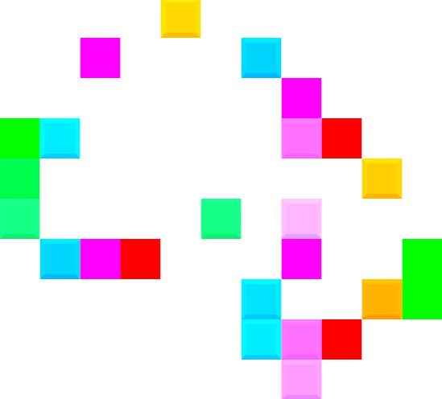

+++
title = "Conway's Game of Life with sound"
date = "2026-07-29"
description = "The classic zero-player game, now with color and sound!"
taxonomies.tags = ["gamedev", "prototype", "bevy", "rust", "game-of-life"]
+++

> Play it on itch.io right now! [popgame.itch.io/life-with-sound](https://popgame.itch.io/life-with-sound)

This was a side-quest.

I was hitting a wall on another gamedev project and thought "I should try coding up Conway's Game of Life".
It's a pretty simple game, but there's some fun challenges like infinite grids and such, let's give it a go!

As I was playing an early build I thought "This is so epic, I wonder if I can sync up some orchestral music to this!"

I don't know the first thing about music, but my friend Sam does!
During our weekly co-op gaming session we brainstormed some ideas and landed on something that had promise:
1. Assign a pitch (Note + Octave) to each coordinate in the game.
2. When a cell is Alive at that coordinate, play the sound.
3. When no cell is Alive at that coordinate, do not play the sound.

Now the grid is infinite in Game of Life, so this had to be a repeating grid, similar to tiling a picture over and over and over on an infinite plane.

I was able to whip that addition up pretty quick and it was good enough to show promise, so I added a few more fun features
* Visualizing each pitch with a different color (note) + brightness (octave)
* Allow customization for:
  * Which notes are active.
  * Which octaves are active.
  * The speed of the simulation.
* A "camera follow" feature that pans and zooms so everything stays in view automatically
* Support touch controls so it actually works on mobile.

This is my first game written in bevy 0.19 and I really like the new `bsn! { ... }` syntax.
It is a pretty concise way to express the contents of a scene, and I really like the `system.spawn()` scheduler method which makes it easy at a glance to see what is spawning my initial world state.
The implicit `..default()` is a really nice quality of life improvement, not needing to _specify_ that I want it to fill in the rest because obviously I do.
My only gripe is that macro-heavy workflows tend to cause headaches because of magic compilation hidden behind pretty syntax; I burned a few hours trying to "fix" a compiler error that was caused by me `derive`'ing something I didn't need to -- rude!

There are plenty more features and polish I _could_ add but I'm calling it here.
It provides an interesting, thought-provoking, experience (for me) and that was my goal.
I could tweak the sound, sand UX rough edges, add ~micro-transactions~ make it prettier to look at, but it works and I feel thoroughly un-blocked on my initial project.

This took longer than I wanted, but I'm happy with how this side quest turned out.