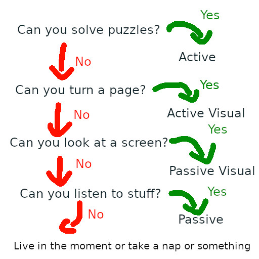

+++
title = "Media Mono-Tasking"

date = "2025-12-25"

description = "Focuing on the good stuff, cutting out the cruft."

taxonomies.tags = [
    "media"
]
+++

I, like many people in 2025, have a looooong list of games, movies, tv, and books that I want to enjoy sometime between now and death.

Some tools I have created to deal with this problem include a [backlog](/backlog/), and a [monthly reflection on what I enjoyed](/whats-good/).
These both help me focus; I either finish a piece of media or I give up entirely.
None of this "Oh I started five books and two shows and a dozen games this month" no: either finish what you started, or basnish it to the shadow realm; there is too much good stuff to drag a bunch of half finish _stuff_ around too.

Between work, taking care of the kids, walking the dog, keeping the house tidy, eating, sleeping, keeping up with friends, and exercising I have ~1-2 hours of "me time" per day to spend on _whatever_.
In the past I woud mindlessly scroll for _hours_ after work and on the weekends, but I had to [lock that shit down](/whats-good/2024/10/#tech-screenzen) pretty quick after having a kid; life's too short to waste perfectly good free time.

Ok here's the thing: between What's Good and The Backlog I feel _ok_ about my media focus, but I think I can do better.
I still find myself starting games I never finish, starting a book on the 1st of the month that's barely half way done by the end, and mindlessly scrolling the one app I didn't lock down yet-- am I really scrolling Libby?

# The Proposal

> Do One Thing at a Time.

If you start reading a book, watching a show, listening to a podcast, _whatever_, that's the only media you consume until you either complete it or abandon that forever.

Not one **book** at a time, or one **movie** at a time, but one _thing_ at a time, across all media.
* Start a movie? You cannot stop half way through and listen to a podcast while you do dishes.
* Start a videogame? Git gud or you're gonna get really bored.
* Start reading a book? Get cozy af because you're locked in.

Of course you can go about your life eating and sleeping and working, but the only _media_ you can consume is _the thing_ until it is done or you call it quits.

Done is subjective, but you get the idea.
* Roll credits on a movie.
* Finish the last chapter in a book.
* Finish a season of television.

## It's not quite that simple

I mean you totally could just do that, but you'd spend a lot of time driving in silence because you started playing Elden Ring and it's good but you're _really bad_ at souls-likes.

And honestly truly doing one thing at a time is like the [Jain vegetarianism](https://en.wikipedia.org/wiki/Jain_vegetarianism) of media diets, it's the most intense version.

I propose, and will personally strive, for a more moderate version which is going to use the following categories to guide our media decisions:
* Active Media: (Videogames) media that requires your participation.
  * Solving puzzles, shooting zombies, stuff like that.
* Active Visual Media: (Books) media that requires your attention.
  * You don't need to solve puzzles, but you do need to flip pages.
* Passive Visual Media: (Movies/TV/Videos) benefits from attention.
  * The media will move on without you, but you should be keeping up.
* Passive Media: (Music/Podcasts/Audiobooks) you can put it on in the background.
  * This is "Doing the Dishes" stuff.

> I'm going to call these "Media Moods" because "Media Situations" feels clunky.
> You totally _can_ do these based on mood, it's just simpler to describe situations that limit what you _can_ do rather than the more fuzzy _what you want to do_.

For each of these moods I would pick a single piece of media to engage with.
Any time you are in that mood, you are reading/watching/listening to that thing, until that thing is done.

For example:
* While I am rowing I finish a movie (passive visual) I started yesterday.
* Later I am cleaning up the house, so I finish a podcast (passive) I stared that morning.
* In the evening I play a puzzle game (active) I have been working on for a few days.
* Until I decide my brain is tired and I want to do something else, so I read this month's book (active visual).

> Yes, I am drawing an arbitrary line between "Active" and "Active Visual" for convenience; you could totally merge those to simplify things even further.

This means that you have _some_ choice of media based on your circumstances, but there is still a prescriptive framework around what you _should_ be doing media-wise to avoid getting easily distracted.

## This is not for everybody

It goes without saying, this is a framework for burning down a backlog.
Even more so, it is for people who have very little time to burn that backlog, and they need to squeeze every minute out of their days to make any progress on that project.

If you don't have a backlog, or you already have a healthy way of handling your backlog, this is probably not for you.

It's also not compatible with like... roommates.
You should definitely make an exception to whatever your media backlog dictates if it means having a good time with friends and/or family.
Don't be weird about it please.

## This is a thing I am trying

It would be awesome if I could say this is something I've been doing for a year and it's worked flawlessly -- but no.
This is just a thing I am starting and trying in hopes that it will improve my backlog burn rate.

And if it doesn't we'll learn something too.
Either way, I'll keep you posted.
