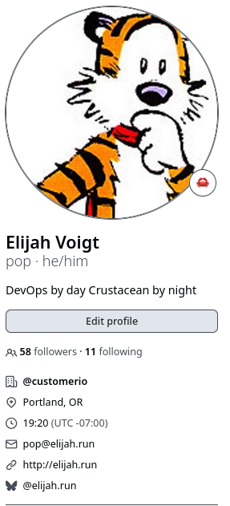
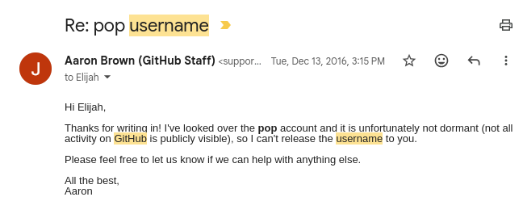
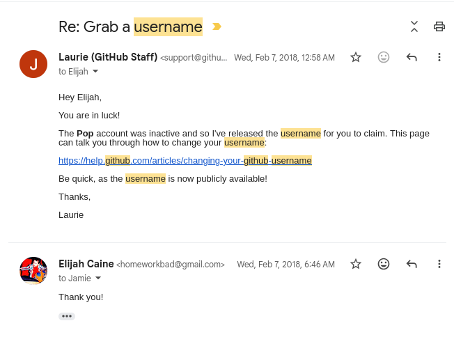

+++
title = "pop"
date = "2026-03-12"
description = "how i got the username github.com/pop"
taxonomies.tags = ["history"]
+++

every time i start a new job folks slowly start to realize my github is `pop`.
you might expect `elijahvoigt`, simple and to the point, or `evoigt-companyname` if i created a new account for this job, or even `pop-n-fresh` if i wanted to be funny.

i take great pride in having the name `pop`, but i have a (very open) secret: i'm not the first person to have github.com/pop.
i stole it.

ok that's a bit dramatic.
here's the whole story.

originally i had the username 'popnfresh' because that was my freenode irc handle and i thought the name was funny.
eventually i scooped up the freenode handle `pop` (i don't have receipts for that one unfortunately).
the thought crossed my mind "i wonder if i can get pop... everywhere."
this was 2016 so of course i was too late for the big sites like twitter but maybe... was github.com/pop taken?
i checked it out and well... technically yes but the account was _not_ active; at least not publicly.

