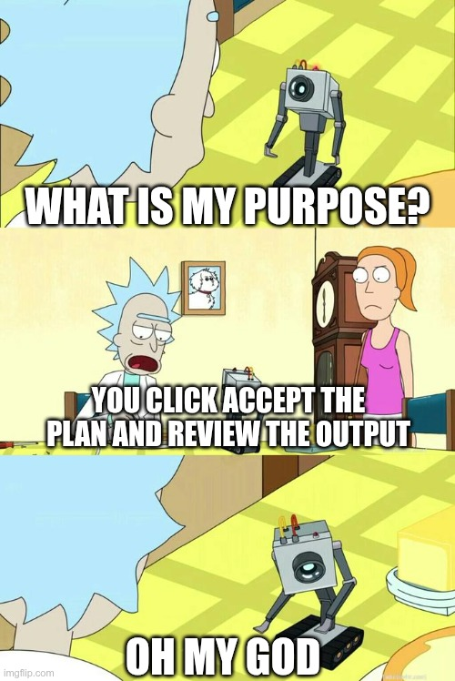

+++
title = "Vibing"
date = "2026-02-21"
description = "i start hanging out with claude and i don't hate it"
taxonomies.tags = ["gen-ai"]
+++

so i started vibe coding and i want to share some fun projects i--

> this feels a bit like back in 2023 when youtubers and podcasts all came out with some variation on "chatgpt wrote this video".
> novel and interesting at the time, cliche in retrospect.
> it feels like every time i refresh hacker news i see a new post about somebody discovering that "hey these robots aren't so bad at coding, the thing i've historically prided myself on being really good at. weeeeeeee"

so yeah i started vibe coding.
or maybe we're calling it pair-programming with an llm.
or maybe it's clicking accept the plan and reviewing the output.

# enough chit chat what did you build?

a few things!

## blog editor

i like my website.
i like writing, curating lists and collections, it's a good creative outlet.
i especially like that it is a static site hosted for free on github pages.
i don't need to pay a monthly hosting fee, i don't need to upgrade a database, it's free costing just my time which honestly i'm not spending very well anyway.

but i do wish i had a web editor sometimes.
because my site is a static pile of html, generated from a different pile of markdown, i really need to sit down at a keyboard to write anything.
historically if my screen doesn't have a git client and a text editor, i can't write a blog post.

but if i had a web editor i could blog _on the go_.
finish a book, blog about it.
have a genius idea for the next billion dollar rust library, blog about it.
notice a typo in my last blog post, blog about it. 

now that code is cheap, i _can_ build such an editor, so i did, and you can find it at [editor.elijah.run](https://editor.elijah.run).
the source code lives with the blog at [github.com/pop/elijah.run/tree/source/editor](https://github.com/pop/elijah.run/tree/source/editor).

the front-end is written in rust with the yew framework, and the back-end... well there really isn't one!
it all uses the github api to create and update branches.
there is a small cloudflare worker that does a github oauth token exchange, but that's basically it.

## not beads (nbd)

the next thing i worked on was trying to use [beads](https://github.com/steveyegge/beads), but hitting a bunch of problems with state get out of whack despite following their very prescriptive workflow.

so i tasked claude with building my own **not** _beads_.
I named `nbd` which i later learned is already a thing for **network block devices**.

thankfully a few days later i learned about [beans](https://github.com/hmans/beans), which is a great name and honestly was exactly what i was looking for.
much more friendly with local-first development, tickets were markdown so you can read and edit them by hand, so i scrapped `nbd` and switched to beans.

## vibebooks

i started using claude to generate custom educational materials, specifically focused at teaching tech concepts hands-on with rust.
i don't think they're _great_, i don't expect them to replace the best professors i've had, but they can certainly replace the _worst_ professors i've had.

instead of hoarding these 6/10 quality resources, and so i can read them on my phone, i published them to [vibebooks.elijah.run](https://vibebooks.elijah.run/) using [mdbook](https://rust-lang.github.io/mdBook/).

## quotesdb

a project i've wanted to do for a while is have a site that i can write down fun quotes.
not like winston churchill quotes but like your friend drunkenly saying "i peak every day" or my kid saying "pinecone apple" instead of pineapple.

so yeah, you can find that at [quotes.elijah.run](https://quotes.elijah.run)