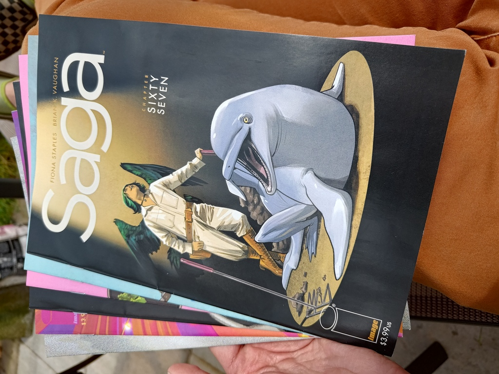
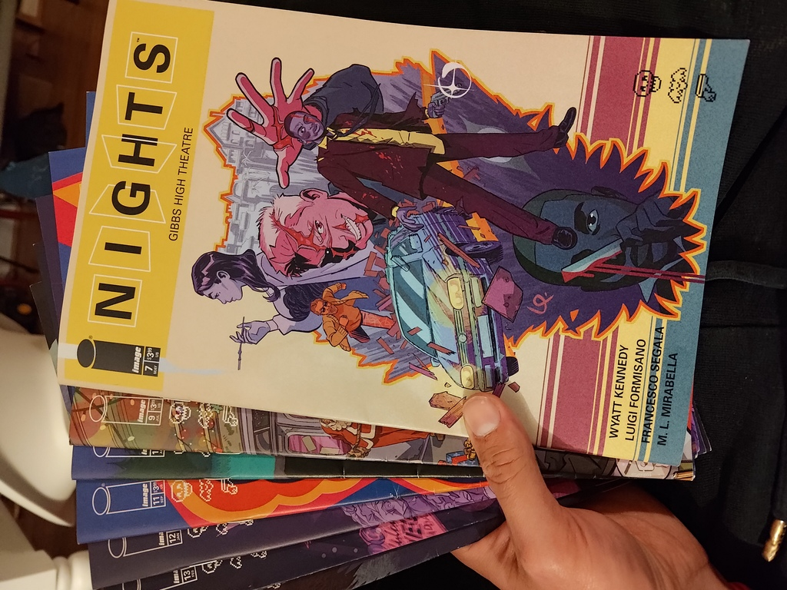
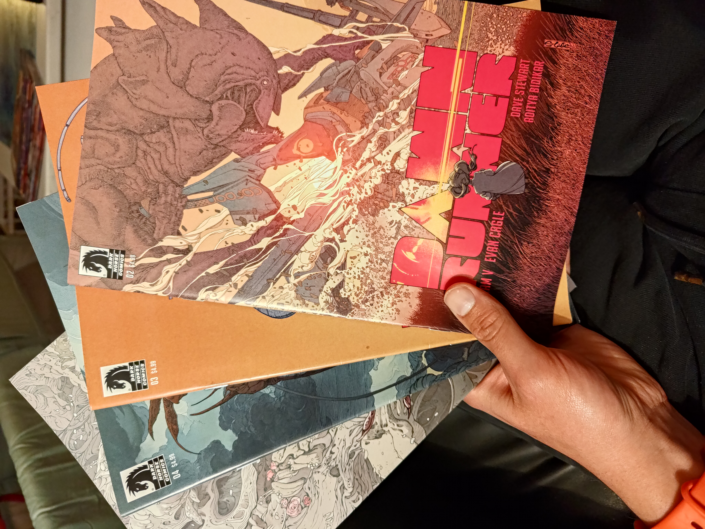
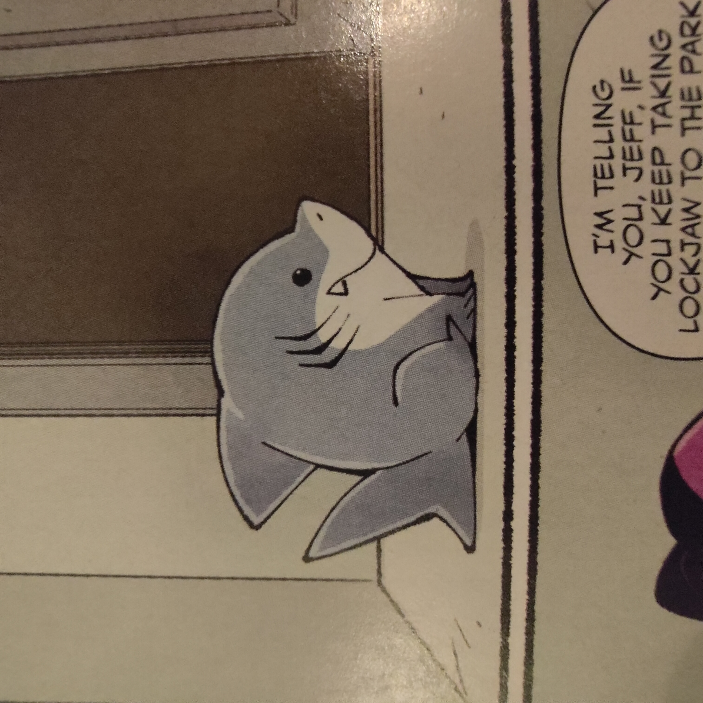
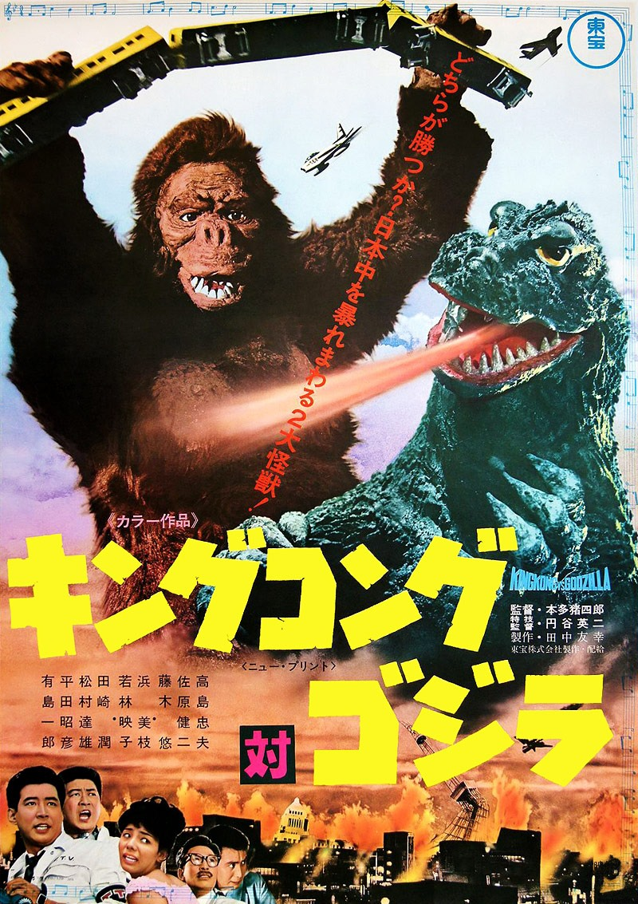

+++
title = "What's Good #7 (April 2025)"

description = "Turning 30!"

date = "2025-04-30"

taxonomies.tags = [
    "whats good",
    "godzilla",
]

draft = false
+++

Hey I turned 30! That's good!

# Boyhood

To celebrate I _finally_ threw myself a birthday party!

Usually I forgo the birthday _party_ in favor of like... a nice dinner or something.
A little treat instead of a big thing.
I lean introverted so why stress myself out?

But I figure 30 is the new 50 or something so I should go big.
I rented out a local second-run movie theater for 3 hours and screened [Boyhood (2014)](https://www.rottentomatoes.com/m/boyhood) with ~40 of my friends.

Boyhood (Lucy's idea) was a great choice.
It's a movie shot over ~12 years and the main character is basically my (and many of my friend's) age, so we all got to experience a nostalgia trip with ipods, hit 2000's songs, and Ethan Hawke.
If you haven't seen it you should!

# The Comics Backlog

Since ~November 2024 I have been working through my comics backlog of ~200 (probably closer to 300 by now) single issue comic books.

I have been collecting new release comics since ~2018 and while I read _some_ of them I never had the habit of reading _all_ of them, so over the years the "unread" pile stacked up.
In November I decided to slay the dragon and finally vanquish the beast that was my comics backlog...

... and 6 months later I finall did!

I read a lot of great comics -- I will write a tier list at some point -- and I am _very_ glad to be caught up.
A weight is lifted off my shoulders now that I have reached *Comic Book Inbox Zero*

> Just ignore my trade paper backs backlog which is like... even more daunting than singles were.

I want to call out my two favorite characters across all 200-300-ish issues...

Jeff (Deadpool, Marvel):

and Sploot (Saga, Image):

I would die for Sploot.

> I just realized Jeff and Sploot are both dog-like aquatic animals. I wonder if that's a coincidence...

# Godzillas (part 1 of 8)

So it turns out there are 38 Godzilla flicks, most of which are in the Criterion Collection!
A friend of mine decided to watch 1 Godzilla movie every week for the remainder of the year -- and hey there are (err were) 38 weeks left in the year.
There's a spreadsheet and everything.

I watched a handful of the old Godzilla films with my grandparents growing up, but haven't done a comprehensive study of the series, so I was more than happy to tag along!

Anyway here's what I think of this month's Godzillas...

## Godzilla (1954)

Godzilla is a classic.
Black and white, dramatic, the guy in the rubber suit is only on camera a bit more than the shark in Jaws was, it's fun.
Totally holds up if you go in expecting a 71 year old movie with accompanying special effects.

Funny enough Godzilla pretty conclusively dies in this one, so all other Godzillas are just like... cousins?
They were clearly **not** in the franchise building mindset at this point.

## Godzilla Raids Again (1956)

I have no idea why it's called "Raids Again" -- Godzilla does not raid anything.
It fights a big ol' dino, fucks some shit up, then gets buried in an avalanche.

The characters are better, the visual effects are better, it does feel like an general improvement on the original.
It's sort of half way between the original one-off story and the later "monster of the week" chapters.

This one at least leaves Godzilla's death bit more ambiguous leaving room for...

## King Kong vs Godzilla (1962)

This is the first Godzilla in COLOR and it pops!
Some "Natives" in one scene have vibrant costumes that really put that color film to work.
The joy of an industry adopting a novel tech and really showing it off -- reminds me of the early days of CGI when each polygon was placed by hand and you _felt every vertex_.

Now it's two guys in rubber suits and they punch and it's awesome!
Also they defeat King Kong by giving him some melatonin which is hilarious.

This film pretty solidly sets up the next 30 years of franchise which is fun in retrospect.
The formula being "X vs Godzilla" with a new X every year or two, print money, repeat.

-- also if Godzilla is a metaphor for the atomic bomb, and King Kong is a metaphor for slavery... I have no idea what this movie is saying.
Probably just "monsters fight hell yeah brother".

Of course it ends with a _very_ ambiguous death to leave room for... another one.
