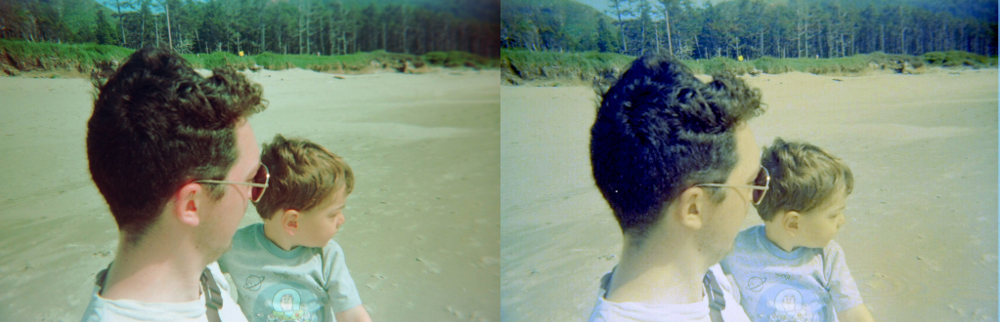
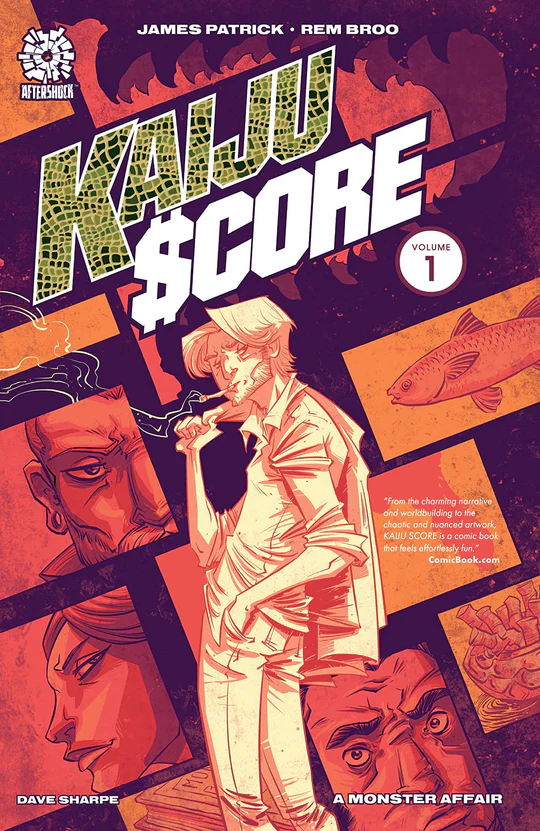
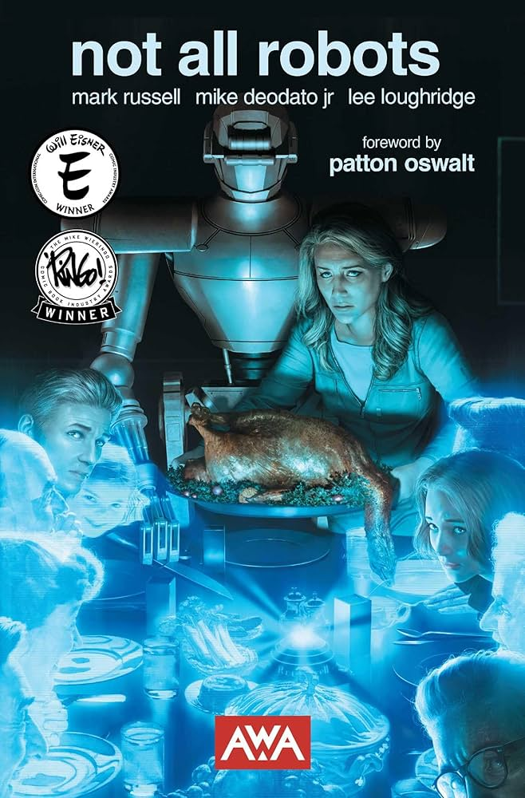
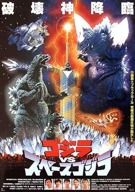

+++
title = "What's Good #11 (August 2025)"

description = "Scanlights, Braid, 17 Pages, Bullet Train, Weapons, Superior Spider-Man, Kaiju Score, Not All Robots, The Nice House on the Lake, and some early 90's Godzillas."

extra.image = "/whats-good/2025/07/todo.jpg"

date = "2025-08-31"

taxonomies.tags = [
    "whats good",
    "godzilla",
]
aliases = ["/whats-good-2025-08"]

draft = false
+++

Hmm.

This looks different... did the website get a haircut?

# Lucy's fancy film digitizing thing

Lucy bought a [scanlight](https://jackw01.github.io/scanlight/) for digitizing film negatives.
At first I thought this was a waste of $150 since we had a totally fine LED lightboard that cost like $20 from Amazon.

Boy was I wrong.
The scanlight webpage (linked above) is very thorough about _how_ it works, so I won't go into that -- something something a good light mixture and no LED lines.

So I'll just just _show you_ a side-by-side of the same picture digitized using the scanlight vs a cheap LED lightboard:

> left: scanlight. right: cheap lightboard.
> Note the reds on my ear come through a lot better on the scanlight.

And here is a zoomed in version:

> left: scanlight. right: cheap lightboard.
> Note the lack of vertical lines where the LEDs are on the lightboard.

I definitely thought these scan lines were just an artifact of like... how the chemicals were put on the film -- nope!
That was totally just an artifact of the lightboard and there are better options.

# Braid Anniversary Edition

I really wish more people played this game.

At ~2 hours Braid is a nice indie title with some really good puzzles.
Braid respects the player's time by having _no filler_; each level explores a new idea and teaches the player something new.

At ~17 hours Braid: Anniversary Edition is _the most comprehensive videogame commentary every created_.
I'm serious this goes into every level, every little decision, explores ideas they _didn't_ do and even makes those into little interactive levels.
It also includes ~25 NEW LEVELS that are hard as fuck.
It's also beautifully crafted with amazing painted moving backgrounds!

If you like puzzles games, you should play Braid.
If you are interested in how games get made, you should play the Anniversary Edition.

# Comics

## Superior Spider-Man (2014)

Doctor Octopus body-swaps with Spider-Man, then Doc-Oc's body (with Peter Parker inside) dies!
It is also a good reflection on having empathy for your enemies.

But right before he dies, Peter Parker (as Doc-Oc) instills the "With great power..." speech to Doc Oc (in Peter Parker's body) and it works!
Doc Oc/Superior Spider-Man tries to be a good guy and honestly in many ways succeeds.
Crime is going down, he's got time for friends and family, things are great.
But of course Doc Oc's criminal tendencies start to seep through and by the end Spider-Man is kind of a super villain with henchmen and everything!

Superior Spider-Man is a _big_ comic book.
Like the compendium I have is _thick_ with ~40 issues wrapped up into one book.

Superior is not an objectively good story, but for a main-line Spider-Man it's exceptional.
The current run of Amazing Spider-Man is _still_ referencing things that happened in this run over a decade ago.
And honestly the bar is so low for Marvel stories, I was blown away at the complexity of this run.

## Kaiju Score

What can I say, I like Kaiju.
This is a heist that takes place during a Kaiju invasion/attack.
It's a very sugary heist story, meaning it stretches that itch but doesn't do much else.
Which is ok!

## The Nice House on the Lake

Wow this was a sleeper for me.
This is such well executed mystery horror and I am here for it.
It's the kind of story that begs you to pay attention to details, flip back between pages, and put clues together.
That said if you just blast through it like I did you'll still enjoy the twists and turns.

## Not All Robots

Not All Robots is a good reflection not only on the obvious themes of automation, but also how a post-scarcity society can be _bad_ if the means of production is owned by an elite few.

I'm not sure why, but it also felt a bit like Alan Moore's "Top 10" comic...
take that with a grain of salt though.
I really have no idea why I got that vibe.

# Movies

## 17 Pages

17 pages is the best demonstration of bias I have ever seen in media.
You are told one side of a story, then surprise there is a part 2!
You start that second part thinking "Well there is no way I'm going to be convinced of... hmm... that's actually a compelling point..."

I have been subscribed to Nebula for a few years because I'm not nerd video essay YouTube.
It really depends on what you're interested in if Nebula "pays for itself" especially since _most_ of the videos are on YouTube, so if you have YouTube Premium, or you use an ad-blocker, it's a similar experience.
That said, if you are interested in seeing this, subscribe for a month and watch it.
On top of being a well constructed documentary (Bobby Broccoli always does good stuff) this had improved visuals and production value.
I'm excited to see what BB does next!

## Weapons (2025)

Weapons is on par with Get Out in instant modern horror classics.
I gasped in appropriately loud a few times in the theater and I felt uneasy most of the movie -- in a good way!

The story telling device of each chapter focusing on a different character was really good at setting up mysteries and then paying them off.

## Bullet Train

This was one of the movies I've been watched while rowing and it is _so fun_.
The action is really well executed, the characters are fun and quippy, and the intensity is well paced.

Similar to "Fall Guy", I love original action movies like this that are little action capsules.

##  Godzilla vs King Ghidorah

This is the first and possibly only Godzilla movie to use time travel, and for that I have to put it near the top of Godzilla movies.
Definitely not S or A tier but solid B or C+ tier.

They do a time travel, get rid of Godzilla, but then -- say it with me: Aliens Mind Control a Kaiju.
Well not Aliens, this time it's humans from the future, but same diff.
So to fight this new kaiju threat we have to bring Godzilla back by nuking a dinosaur.

This is a very silly one.
Worth the watch.

##  Godzilla vs Mothra (1992)

The real monster is Climate Change.
And the REAL monster is us for making Climate Change.

The special effects with the... Fairies(?) is much improved!
I love watching the history of budget special effects evolve throughout these movies.

##  Godzilla vs Mechagodzilla II (1993)

I'm just going to share my stream of consiounce notes I took during this film:

> So there's an giant Kaiju egg in a hillside that gets discovered when a storm does some erosion.
> Unlike previous eggs this does not get turned into an amusement park attraction but is instead studied for science.
> During said science they piece together that the egg glows red when it is scared, and it is not scared when a specific female scientist is around.
> Yes this is a Mecha Godzilla movie.
>
> Anyway Mecha Godzilla and Godzilla fight.
> Mecha loses.
> The egg hatches and apparently this is a baby Godzilla -- but this is not Manilla, this is a different *vegan* baby Godzilla.
>
> The anti Godzilla airplane is brought back after being shelved previously, both decisions being pretty haphazard.
> They study baby Godzilla and find a second brain in it's butt, and extrapolate that Godzilla also has a butt brain.
> So they decide to fight Godzilla again with Super Mecha (Mechagodzilla + the airplane) but this time aim at Godzilla's butt.
>
> They almost win, but then Rodan -- did I mention Rodan is also here? -- flies in, dies on Godzilla, turns into energy glitter, causing Godzilla to go super sayan totally destroying Super Mecha but conveniently not the crew because screen cast doesn't die.

So yeah... not perfect but pretty fun.

##  Godzilla vs SpaceGodzilla (1994)

Growing up I played an awesome fighting game where you played as different Godzilla Kaiju.
It may have been "Godzilla: Save the Earth" or one of the other games in that series.

I distinctly remember playing as Mechagodzilla, Godzilla (classic), and my favorite character: SpaceGodzilla!
The Kaiju felt so distinct in their fighting styles and it was (to a 9 year old's sensibilities) a kickass fighting game.

Anyway Space Godzilla was a total snooze fest for me save for one awesome mech scene at the end.
My notes include:
* Everybody is super chill around baby Godzilla.
* Baby Godzilla is way better designed than Minilla (Son of Godzilla).
* If the entire Japanese Defense Force can't take down Godzilla why does one man on an island think he can...
* SpaceGodzilla's origin is from way back in Biollante??
* OK the mechs combining is awesome and very Power Rangers.

Next month:

* Godzilla vs. Destoroyah (1995)
* Godzilla (1998)
* Godzilla 2000: Millennium (1999)
* Godzilla vs. Megaguirus (2000)
* GMK: Giant Monsters All-Out Attack (2001)
