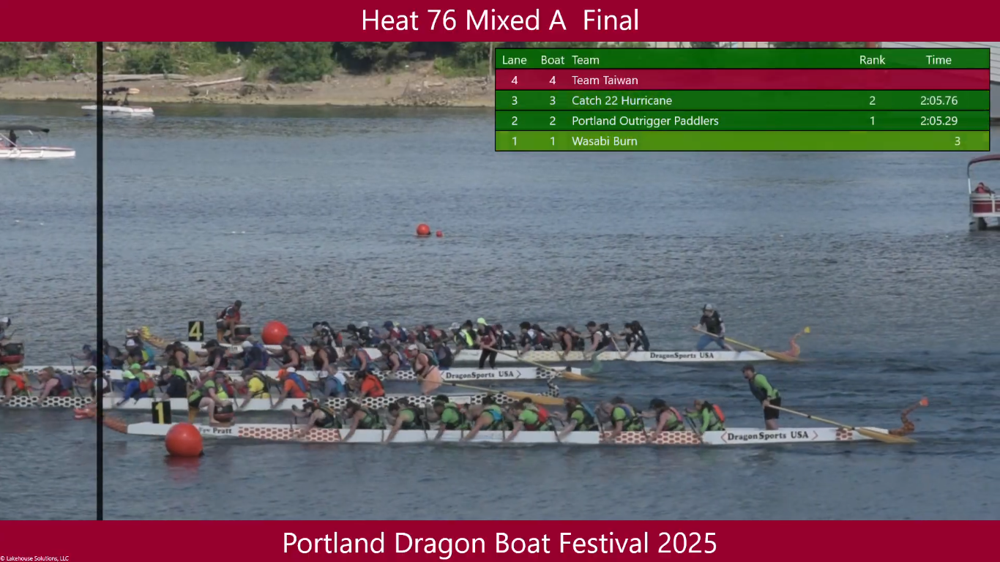
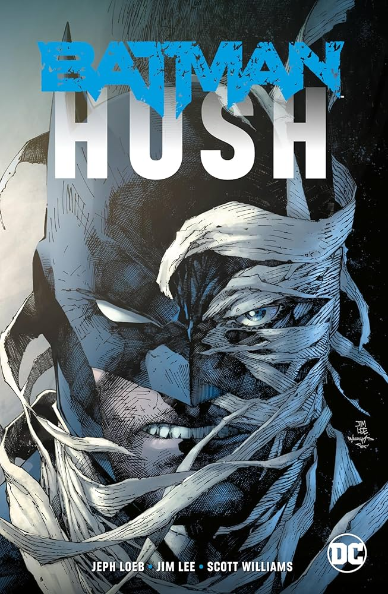
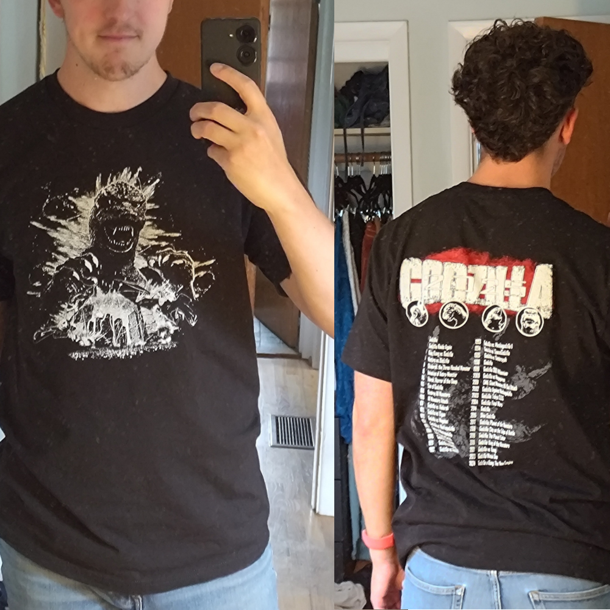
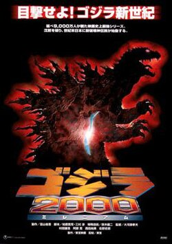

+++
title = "What's Good #12 (September 2025)"

description = "Dragon Boats, Flappy Bird (with rewind), Blue Prince, Batman Hush, Gotham City: Year One, Godzilla (1998), and Godzilla 2000 Millennium"

extra.image = "/whats-good/2025/09/todo.jpg"

date = "2025-09-30"

taxonomies.tags = [
    "whats good",
    "godzilla",
]
aliases = ["/whats-good-2025-09"]

draft = true
+++

# Getting 3rd in a Dragon Boats Race

My main social/physical activity is Dragon Boats.
Two or three times a week I bike to the Portland water front and meet up with ~20 other paddlers, stretch, get on a boat, and paddle a big boat around and it's super fun!

# Flappy Bird (with rewind)

I released a game _very_ early in the month called [Flappy Bird (with rewind)](/games/flappy/).
It's free to play and runs in your browser so check it out!

# Blue Prince

Blue Prince is a really interesting rogue-like(-ish) mansion builder.
This is maybe the first game Lucy and I have played together because she was really interested and for some reason it's not on Switch!?!?

Lucy and I played for ~15 hours together, which is the first time we have ever played a videogame together.
The puzzles are really interesting and I genuinely felt like I got something new out of every run, unlocking new info every iteration.

Now for the less good parts... I had to quit after 15 hours.
My stamina for long games has never been good and when every 30-60 minute run only produces _maybe_ one piece of information in a game that has no clear path to completion... I start to question if this is the best use of my time.
On top of that a lot of the game presents what are, in my opinion, red herrings; dates that aren't the solution to a puzzle, props that are just for decoration, a third thing.
A good puzzle game has very little on top of the mechanics of the puzzle, and those things that are "just set dressing" should be clearly messaged as such, but in this game _everything_ feels like it's saying "Look at me! I'm a clue!" and it's exhausting.

Over all, if you like puzzle games you will probably enjoy Blue Prince.
It's especially good for couples who want to play together as there is a lot of room to brainstorm and discuss strategy!
The randomness can be frustrating, but if you are used to rogue-like elements it won't be _that_ bad.
If you've had a bad run in Balatro it's no worse than that.

# Everything Must Go

I listened to the audiobook version of [Everything Must Go](https://www.powells.com/book/everything-must-go-the-stories-we-tell-about-the-end-of-the-world-9780593317099) by Dorian Lynskey this month and enjoyed it!
He does a good job of covering a lot of the breadth and history of "end of the world" stories without you know... being a massive bummer.

# Gotham City: Year One

[Gotham City: Year One](https://dc.fandom.com/wiki/Gotham_City:_Year_One_Vol_1) is a straight up good noir story that _happens_ to be a prequel to Batman.
If you like the Noir genre you'll enjoy this read.

# Batman: Hush

[Batman: Hush](https://dc.fandom.com/wiki/Batman:_Hush) reminds me a lot of [Batman: The Long Halloween](https://en.wikipedia.org/wiki/Batman:_The_Long_Halloween).
It spans over 12 issues, hits on most of the star villains, and has some twist at the end that it's building up to.
I prefer Long Halloween, but Hush was a solid story with some interesting bits and taught me a bit more about the character(s) of Robin than I expected to learn.

# Godzillas

## Godzilla T-Shirt

I commissioned a t-shirt!
I had the idea for a shirt with a kickass Godzilla collage on the front and a "band tour" list of all Godzilla movies on the back.
Coincidentally Blake Hester, of [Something Rotten Podcast](https://nebula.tv/somethingrotten) Fame -- among other things, designs t-shirts and announced on Bluesky that he was accepting commissions.
I slid into his dm's and he accepted the project!
A few weeks later I had the designs, found a local printer (willing to print copyright material) and got a small order!
I'm sending this to folks participating in the Godzilla weekly movie thing, but I have a few extra so if you're interested email me at godzilla@elijah.run (yes that is a real email that goes to my inbox).

## Godzilla 1998

Here's a controversial statement: Godzilla 1998 is pretty good.
It's not a good _Godzilla_ movie, it's more of a Jurassic Park/Aliens knock-off, but it's a really good knock-off!
The jokes land, it's not distractingly 90's in it's you know misogyny, and the practical effects hold up really well.

## Godzilla 2000 Millennium

Godzilla 2000 Millennium felt... off.
Like Toho was going through the motions on this one.
The story was uninspired re-using a surprising number of elements from previous films like space ships that turn into Kaiju and the Defense Force trying yet again to kill Godzilla even though that has literally never come close to working since the first movie.

# The Backlog

I also started a project called [The Backlog](/backlog).
It's actually the public version of a private backlog I've had in Obsidian for a few months now, but I figure to build the habit of writing I would start publishing those little notes I jot down after I finish something.

I am already overwhelmed at the number of games and tv shows I would like to watch...
