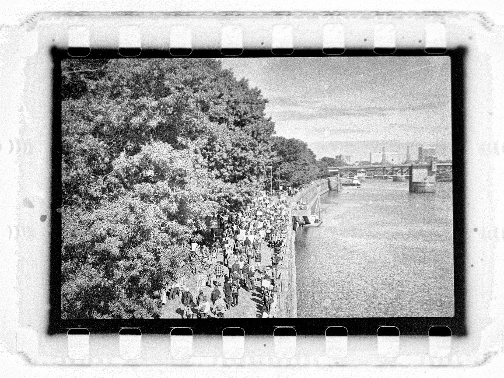
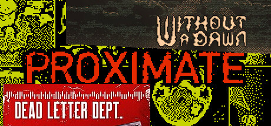

+++
title = "What's Good #13 (October 2025)"

description = "No Kings Protests, Proximate, Dead Letter Dept., Without a Dawn, Godzilla Against Mechagodzilla, Godzilla Tokyo S.O.S, Godzilla Final Wars, and Godzilla (2014)"

extra.image = "/whats-good/2025/10/todo.jpg"

date = "2025-10-30"

taxonomies.tags = [
    "whats good",
    "godzilla",
]
aliases = ["/whats-good-2025-10"]

draft = false
+++

# No Kings Part II

> It was really difficult to capture the scale of the protests, so I chose this pretty picture instead.

My sisters and step-mother visited from Chicago for a weekend and while in Portland we went to the No Kings protest.
We grew up going to protests during the George W. Bush era so this felt like a totally appropriate family activity.

The crowd felt massive, stretching tens of blocks around the city.
People were in inflatable costumes, I saw some good signs, and felt politically energized.
I also wish I had brought the kids.
I was worried about safety, but in practice it was totally civil.

# Proximate, Dead Letter Dept., Without a Dawn

Jacob Geller came out with [a great video about these three games](https://youtu.be/0zxQ9YAzy00) which I highly suggest you watch.
The bit that these were such short games hooked me and inspired me to play them _before_ watching the essay to sort of "do my homework before class".

This was a neat exercise that I don't usually have the opportunity to do.
Most videogame essays I watch are about sprawling series that require hundreds of hours and a [crazy high skill level](https://youtu.be/lnAWQz34PJs) to even _see_ the stuff the author is talking about, fair enough have interesting thoughts about the topic.
I'm in my dad mode phase, I don't have time to play every Dragon Age game -- I barely have enough time to watch your [6 hour 40 minute video on the series Noah](https://youtu.be/Vrd6GpZXvdk)!

So I was happy to have a (roughly) 3 hour block of games to get through and be "caught up" before watching this latest Geller essay.
And it was totally worth it!
All three games were appropriately spooky for, you know for October, and I even had thoughts about the games _before_ hearing a smart man talk about them.

Proximate was the first one I played and my favorite of the bunch.
The mechanic of interacting with the world through a layer of abstraction felt very "meta"; you interact with this game world through a keyboard and mouse and screen, so adding another layer of abstraction builds on that.
Also the sound design made me pee my pants a lil.

Without a Dawn was the next one I played.
I didn't really connect with the story and felt frustrated with the lack of choice present in the game.
I know that's sorta the bit and there's narrative meaning there but like... it wasn't for me.
The shader effect was very cool though.

Dead Letter Department was the last one I played and at first I didn't "get it".
I followed instructions, chose the edgy dialog options, and got a bonkers ending after ~2 and a half hours of gameplay.
It was weird and spooky but then I watched the essay and realized there are _lots_ of endings and _lots_ of ways to try to break the game!
Sending yourself letters, different choices, lots of room for player creativity that I was so on auto-pilot I didn't realize were there.
It almost felt like the environmental choices in Spec Ops: The Line, but in a spooky glitch grunge package.

# Godzillas

This month we hit the 2004 - 2014 hiatus which is huge!
We're finally in what I would call the "modern era" of Godzilla.

## Godzilla Against Mechagodzilla

Main takeaway: lots of explicit death in this one.
Never really addressed, but you definitely notice the change in mood.

## Godzilla: Tokyo S.O.S.

This is just a mech film with Godzilla.
Also lots of people explicitly dying, weird theme.

## Godzilla: Final Wars

You probably haven't seen this one yet, but you should!

This is the first Godzilla movie in a _very long time_ that I am suggesting to friends and family.

It's like The Matrix + Power Rangers + Godzilla in one whacky package!

## Godzilla (2014)

I liked this one!

The camera work was grounded which really sold the scale of Godzilla in ways never seen before -- I can say that because I've seen all the other ones!

It's like Cloverfield + 2010's era disaster movies + Godzilla in one exciting package!
