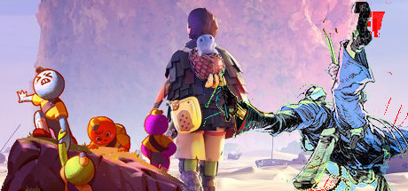
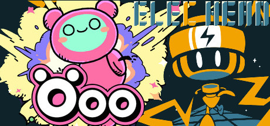
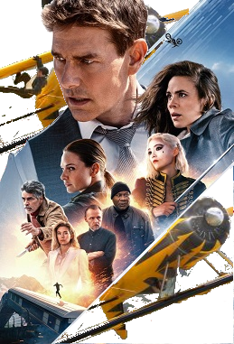
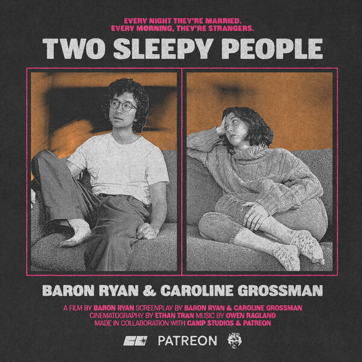
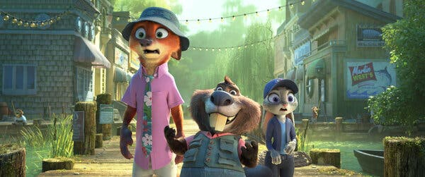
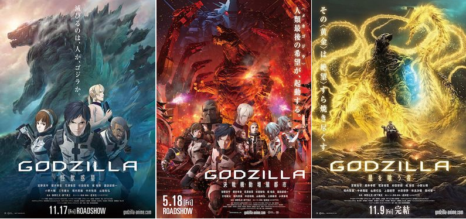

+++
title = "What's Good #14 (November 2025)"

description = "Mission Impossibles, climbing games, cute platformers, Defunctland, Two Sleepy People, Zootopia 2, Shin Godzilla, Godzilla Anime."

extra.image = "/whats-good/2025/11/todo.jpg"

date = "2025-11-30"

taxonomies.tags = [
    "whats good",
    "godzilla",
]
+++

# Peak, Jusant, and Sky the Scraper

I played these three games that all kinda float around the theme of "climbing".

Peak is a wonderful co-op climber where you help your buddies get up to the top of a mountain that really is trying to kill you.
My highlight is the wacky physics and the proximity chat which never fails to entertain; hearing your best friend's yells "Oh no oh no oh noooooooo" get rapidly quieter as he falls off a ledge is just the funniest shit.

Jusant is a beautiful, dense, and interesting world.
Climbing this giant pillar mesa thing is really fun and has some genuinely interesting climbing puzzles.
It also tells a beautiful story with, as far as I can remember, zero spoken words.

Sky the Scraper is two games in one: an arcade window cleaning game and a very stressful life management simulator.
You spend like a minute cleaning windows and it's really fun and challenging, then you spend like five minutes responding to texts from your mom about how sad she is that you haven't visited in a while, then you go for a walk.
The arcade minigame is really fun though so it's worth it.

# Elechead and Öoo

Elechead is a cute platformer puzzle game with a strong core mechanic explored in ~2 hours.
The core mechanic is that you are a little battery-headed robot that turns surfaces on and off by touching them.
Believe it or not there's a good number of puzzles that fall out of that mechanic and this game has most of them!

Öoo is a cute platformer puzzle game with a strong core mechanic explored in ~2 hours... wait we just did this.
Anyway the mechanic is that you place and blow up bombs to get around!
Öoo is very cute and the puzzles are challenging.
I did feel Öoo was a bit more polished, so it's cool to Takahashi's skills getting even better.

I love that these two games are short and sweet, but not so short that they leave ideas on the table.
They explore the mechanic they set out to do and do it well.

I had never heard of the creator of these two games, Nama Takahashi, but I am a fan of their work and will keep tabs on them going forward.
I could play "Cute character has this one weird trick you won't believe!" forever.

# Mission Impossible: Dead & Final Reckoning

I am still [rowing with Tom Cruise](/whats-good/2025/05#rowing-with-tom-cruise) and finished the Mission Impossible series this month.
The AI enemy was a little on the nose and honestly it would have been such a good twist if there was no real AI and it was just classic espionage double cross something something -- but alas Mission Impossible played it straight to the end.

That'll do Tom.
That'll do.

# (Defunctland) Disney's Living Characters: A Broken Promise

The final part of Defunctland's two-part series on Disney's Animatronics/Living Creatures was really spectacular.
A four+ _hour_ documentary about animatronics, digital puppets, and a ton of really cool stuff!

Defunctland is one of the artists I support on Patreon and I think you should do the same.
They publish like two big videos per year, a podcast, some miscellaneous goodies.
It's not a _lot_ of content, it's certainly not _consistent_c content, but goddamn it is good.

# Two Sleepy People

I'm not on TikTok anymore, but when I was I followed Baron Ryan.
I liked his style and appreciated that he stuck to it, sharpened his craft, and perfected it in little bites.

I was skeptical that he could deliver on a full length project but he (and a really good team) delivered!
I laughed, I cried, I enjoyed the twists and turns.

This is a genuinely good movie and if you get a chance to see it you should.

Support indies.

# Zootopia 2

Uhh... and then go see Zootopia 2 because it's fun.

I was a _huge_ fan of Zootopia.
I'm not a furry or anything, but I am whatever you would call a furry for buddy-cop movies and Zootopia delivers on the genre.

I admit the sequel didn't have the same spark as the first one, but I suspect it'll grow on me with repeat viewing (legally required when you have two small children).
Honestly there are many worse fates than watching Zootopia a couple dozen times.

# Godzillas

## Shin Godzilla

Oh my god yes yes yes yes yes.
Dude this is so good.
Like I can tell you how and why but I promise it's just _good_.
Go watch it right now.
I don't care if you already watched it _today_, go watch it again!

Ok now that you're back, let's review:
* Got pacing on _lock_. It's like West Wing meets... Godzilla.
* The CGI looks _incredible_. They really sell the scale in some of these shots.
* The ENDING SHOT. No spoilers, go watch it again.

## The Anime Trilogy

The Anime... were not as good as Shin.
Which makes sense, nothing is as good as Shin (for now), but they did do some interesting stuff!

The trilogy follows humans who were forced to leave Earth because the Kaiju took over or something.
They leave, come back, and fight Godzilla.
You... you probably could have figured that second part out from the premise.

### Godzilla: Planet of the Monsters

Planet of Monsters was the weakest of the three for me.
The Animation style was hard to adjust to, but by the end I was enjoying it.
They're able to do things visually that they simply could not get away with in a live-action Godzilla on a reasonable budget like explosion simulations and good looking space ships.

Also the twist after they defat Godzilla was... classic.

### Godzilla: City on the Edge of Battle

City on the Edge of Battle actually worked for me.
The characters has time to grow and develop, it almost felt more like Aliens.
The final scene was super epic and the movie's take on Mecha-Godzilla was trippy.

### Godzilla: The Planet Eater

The Planet Eater was the most psychedelic of the bunch, almost leaning into cosmic horror stuff.
Battling inner daemons manifested as uhh... Kaiju destroying the real world.
Cool stuff!

Over all I would say the Anime trilogy is fun but not great.
Get baked and enjoy the pretty visuals and you'll have a good time.
