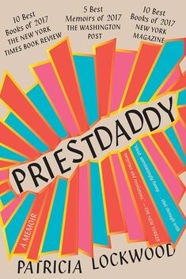

+++
title = "What's Good #15 (December 2025)"

description = "Priestdaddy."

extra.image = "/whats-good/2025/12/todo.jpg"

date = "2025-12-31"

taxonomies.tags = [
    "whats good",
    "godzilla",
]
+++

Between the holidays and some personal struggles this month I wasn't able to _finish_ as many things as I would like, so I don't have as much to share as I would have liked.
Next month though I should check off a few half-finished projects so we'll start the year off with a bang.

# Priestdaddy

I read this on the repeated recomendation of Jacob Geller, one of my favorite creators on the internet who I gladly support on Patreon.
A beautiful narrative autobiography written by a poet, meaning the pros are so goddamn vivid and imaginative I had to stop and take a breather every few pages just to process what I had read.
I laughed, I cried, a had a think.
Good book.

# Godzillas

This is it!
We're done watching all of the Godzilla movies!

I am so happy to have done this project and to have shared it with some friends.
I have enjoyed watching not just Godzilla evolve over 70+ years but seeing _movies_ evolve over that time too.

I'll write a dedicated post about Godzilla before too long, so let's wrap this up.

## Godzilla: King of the Monsters

Continuing where Godzilla (2014) this movie rocks.
It's got _tons_ of monsters even digging deep for kaiju like Rodan!?
What a legend.

The writing isn't perfect, but as far as CGI spectacle movies go this is incredible.

Note: I think this gets a bad reputation because American audiences don't like the story structure -- but my hot-take is that this _perfectly_ updates the _classic_ Godzilla formula for a 201X audience and the old movies just also kinda sucked.
In a lovable way of course.

## Godzilla vs Kong

I'm not entirely sure why Godzilla gets top billing in this movie because it is _clearly_ a Kong film.
He's the main character and most of the story beats follow him.
Which is fine, but you know... my boy is GZ, let's give him equal screen-time.

## Godzilla Minus One

A wonderful modern echo of the classic 60's era Godzillas, calling back to many tropes like:
* A scientist has a long-shot idea for how to kill Godzilla that is only taken seriously after literally nothing else works.
* Godzilla is finally defeated when Japan builds some crazy long-shot industrial thing.
* There is a "boat guy".

If I were to re-watch the pantheon of Godzilla movies I would probably watch this after watching some of the 50's/60's era films before they got too silly.
That seems to be the era most of the references/echos are from, but I watched them so long ago at this point most of it went over my head.

## Godzilla x Kong: The New Empire

I _really_ wished we had ended with Minus One, but I guess we gotta end it with the actual latest entry, not just the one I _wish_ was the latest.

Godzilla x Kong really is Godzilla vs Kong 2.
A very similar cast of (human) characters with a bunch of new monsters that to my knowledge are _not_ in any prior/older Godzilla flicks.

Similar to the current (?) run of American Godzilla films, it's a totally passable spectacle film but doesn't hold a candle to what Japan is doing with it.
