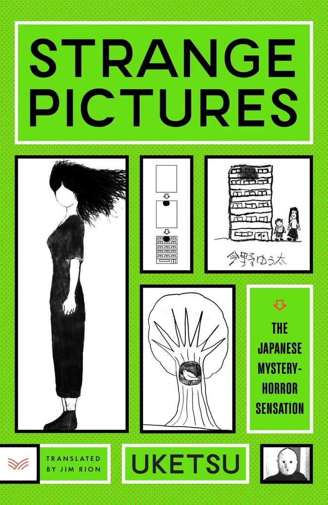
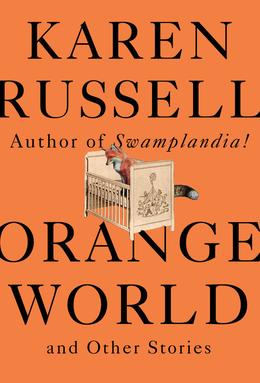
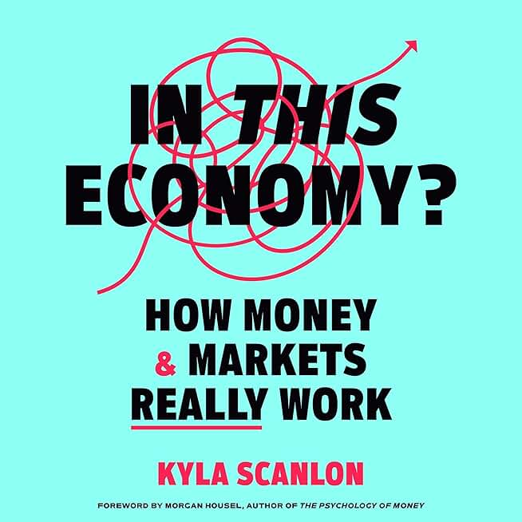

+++
title = "What's Good #17"
date = "2026-02-23"
description = "Indika, Solitaire(s), Strange Pictures, Orange World, Shell Game, and In This Economy?"
draft = true
taxonomies.tags = ["whats-good"]
+++

# [Indika](https://store.steampowered.com/app/1373960/)

Oh my god.
Fuck yeah dude.
Video games rock.
Ok I guess we're just going to casually play a game that changes how we think of games _every month_ now?

Indika is beautiful, going for a mostly photo-real style to help deliver the grounded story telling it's going for.
That story, of course, is that you are a nun who is having a mental breakdown and all the other nuns hate you so they give you a more or less impossible task that you totally abandon.
It is hilarious, thought provoking, and well produced in every way.

My favorite detail of the game is noticing how things are constantly getting... slightly... bigger... until they're like... impossible.

Also the level with the rotated mirror rooms blew my fucking mind.
I literally had to put my Deck down and put my brain back together.

It's like 4 hours.
Just play it.

# [Solitaire(s)](https://store.steampowered.com/app/1988540)

# [Strange Pictures](https://www.powells.com/book/9780063433090)

This spooky mystery was an xmas gift that I went into totally blind.
The cover page was enticing but I really didn't know what to expect.

Each chapter tells the story of a mystery which , spoiler, are all connected.
It offers a good balance between short stories, each chapter it it's own mystery, and the over-arching narrative, trying to figure out the throughline.

# [Orange World and Other Stories](https://www.powells.com/book/9780525656135)

I am starting to realize that I love magical realism.

I grew up thinking of myself as a sci-fi kid, but the more I read stories that more or less ditch the tech in favor of magic -- set in the modern day -- the more I think "dang that's cool I want more of that".

Specifically keep thinking about the Storm Rustler.
A beautiful story of an old man obsessed with proving he still has it in him to raise one more story to wreck havoc on the world.
And yes, all of that is literal and makes perfect sense in the context of the story.

# [Shell Game](https://www.shellgame.co/)

Shell Game is a podcast about a human, Evan Ratliff, taking AI hype at face value and putting it to the test.
I can send an AI to go to a meeting and take my place?
Challenge excepted.
AI is going to take all of our jobs and there will be a 1 person unicorn startup?
Let's get cracking.

He pushes technology, and frankly social situations, beyond what you or I would be comfortable with, and juuuust up to their breaking points.
It results in a very informative show about what AI and and cannot do, and super entertaining too.

Shell game is an interesting podcast in 2026 because as you listen to it you can _feel_ it getting dated.
He's building things that have been solved dozens of ways by even more companies but he's doing it _before_ they are.
It'll be a wild podcast to listen to once the Generative AI boom/bust has settled as a snapshot into the questions we were asking and the ways we were trying to use this tech while it was being developed.

# [In This Economy? How Money and Markets Really Work](https://www.powells.com/book/9780593727874) (Audiobook)

I am a fan of Kyla Scanlon from TikTok and YouTube.
She has a great way of talking about Economics that meshes well with my own opinions -- which basically boil down to "the system is broken, but the solution is human focused policies, not to burn it all down."
She understands how economics works (duh, she is very smart) but is very good at consistently tying that back to how the economy is people and how it should be for people and why it is failing to fulfill that need.

Was this a fun book to listen to?
Not really, but it was way better than the economics textbooks I've read so definitely a good resource if this topic is of interest.
