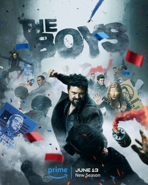
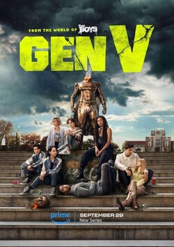

+++
title = "03"
date = "2026-03-29"
description = "Still Lost, Hail Mary, The Boys and Gen V"
draft = false
taxonomies.tags = ["whats-good"]
+++

This was a pretty sparse month, but really good stuff on the docket!

# Still Lost (Sam A. Miller, 2026)

I have been a fan of [Sam O'Nella Academy](https://www.youtube.com/channel/UC1DTYW241WD64ah5BFWn4JA) for as long as I can remember so when out of nowhere a video popped into my subscriptions with both a book _and_ a face reveal, I was gobsmacked.

I ordered the book on Amazon -- I would have bought it from Powell's but alas they got me with that Amazon self published thing -- and I thoroughly enjoyed it!

If you like near-term sci-fi with an interesting, goofy, and admittedly "out there" conceit you should check it out!
He's certainly no Ted Chang, but it's light hearted sci-fi with interesting premises, what more do you want!?

As a bonus I started following Sam O'Nella's daily crossword videos which got me back into crosswords.

# Hail Mary (Movie, 2026)

For the record, as the credits started rolling I thought "That's on par with Arrival" and I think that take will age well.

Hail Mary is a really good adaptation of a really good book.
It skips over the stuff that would make a bad movie, and buffs up the parts that make a good movie.
It helps that I could watch Ryan Gosling take out the trash...

# The Boys Season 4 / Gen V Season 1

I started watching The Boys as my rowing show because it is exciting and based on how much I row it neatly slots in to ~2 sessions per episode.
Season 4 continued to be exciting with fun twists and turns, but started to suffer from the "When is this going to end?" problem that a lot of modern TV suffers from.
It's good TV but after 3-4 seasons of the same thing you start to "get the formula" and wonder when they're either going to change it up, or close it out.
Thankfully we're in for a banger (hopefully) of a 5th season.

As a bonus, the VFX Supervisor has been on VFX Artists React a few times, one of the indie-subscription-services I follow, and he's really fun.

I gave Gen V a shot this month because I was still kind of in the mood for more The Boys and was hoping that series would tide me over.
Season 1 was good, and I can't speak for Season 2 yet.
It's a classic college drama with super heroes, just what it says on the tin.
I'm really not watching for brilliant compelling TV, I just want something that's exciting and dynamic and like The Boys it is both of those things!