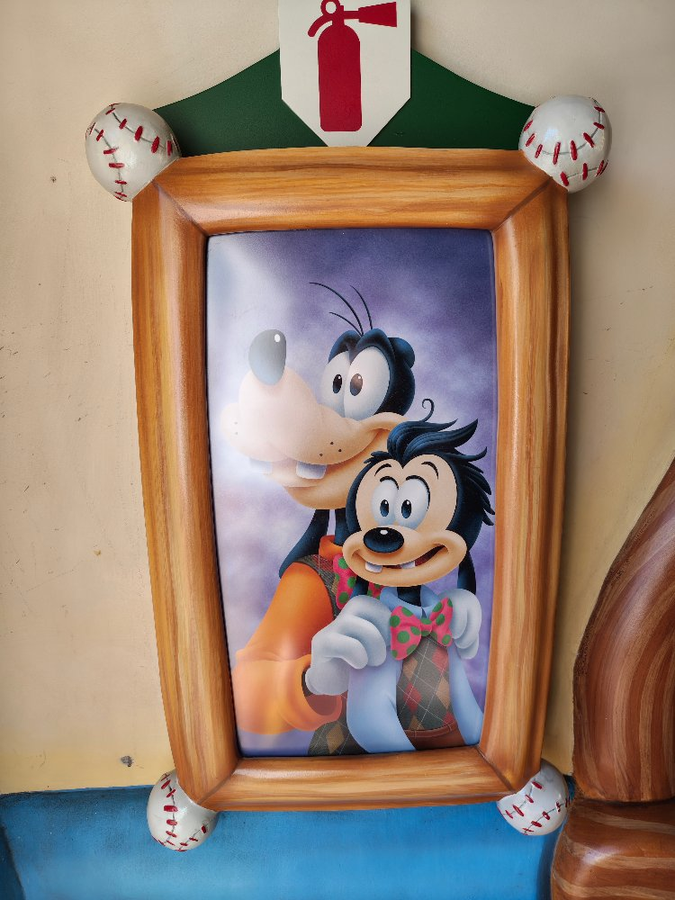
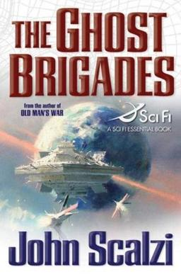

+++
title = "What's Good #19"
date = "2026-05-02"
description = "Disneyland, Ghost Brigades, Still Lost, and Old Goriot"
taxonomies.tags = ["whats-good"]
+++

# Disneyland, CA

The highlight of this month was that the whole family went to Disneyland (and California Adventure) for my birthday!

I've watched dozens of hours of Defunctland, so I felt more or less qualified to go to Disney and gave a good time... but it was so much more intense than the simulations prepared me for.

We went on a few rides, despite being height challenged with two under-3-year-old-boys, and generally had a great time.
I also feel more qualified than ever to go _back_ to Disneyland because wow that was a wild experience that I was not ready for.

## Pixar Hotel

We splurged and stayed in the Pixar hotel which is, relative to some of the other options, cheap -- but objectively speaking was kind of spendy. 
It was fun to stay at a themed hotel, look for Easter eggs all over the place, and of course it was fun for my kid who loves Toy Story and Pixar to point at Buzz Lightyear mural and say "To Infinity and Beyond!" every time we passed by.

## Goofy's Kitchen

Our first night we went to this "Meet and Greet" buffet experience in the main Disneyland Resort.
You start by getting photos with the establishes owner, Goofy himself, then after you sit at your seat you're visited by Minnie Mouse, [Clarabelle Cow](https://en.wikipedia.org/wiki/Clarabelle_Cow), and some chipmunk characters.
I am always impressed with how well the cast members play the characters and communicate without (being able to) say a word!

## Teacups

My wife regailed us with stories of riding Teacups dozens of times in a single rainy day when she was ~6, subjecting her dad to a day of torture.
My kids loved it, great first ride.

## Toon Town

I've written before about my foray into the Toontown Rewritten MMO so visiting Toontown IRL was a must.
Obviously video games can look very whimsical and wacky so it was very impressive how it achieved the exact same vibes in real life.

## Mickey & Minnie's Runaway Railway

Holy crap this was a great ride.
The way the Mickey and Minnie faces were perfectly projected onto animatronics objects, the way the omni-directional cars jerked you around, everything was a over the top and like nothing I've ever experienced before.

## Finding Nemo Submarine Voyage

This was... nice, but as a follow-up to Runaway Railway felt flat.
At least the line was pretty short, and it was a chill recovery for the kids.

## Autopia

This was our longest wait of the day but totally worth it.
My toddler was able to drive a car! 
I mean obviously not on the open road, it was on a guide rail, and I controlled the gas, but you get the idea.
He had a blast.

## Bluey's Best Day Ever!

This is a good activity to do to chill out after a very overstimulating few hours. 
The Bluey show is a live performance with music and skits and room to dance up front/plenty of seats to just sit and watch.

## Disneyland Railroad

Next we took the Disneyland Railroad from the Bluey performance to Adventure-land to ride Jungle Cruise.
Not only is the train cool, because you know trains are cool, but there's also a section in the middle where it becomes a dark ride passing exhibits about dinosaurs and the Grand Canyon; very neat.

## Jungle Cruise

Next we did Jungle Cruise which I think is a classic.
Our cast member running the boat was very talented, cracked a lot of jokes, and was clearly very experienced so he was the highlight of the ride for me.

## Pirates of the Caribbean

To finish our first day we did Pirates of the Caribbean which is also a classic and also super fun. 
Especially for our almost 3 year old it was the perfect amount of scary and whimsical.
Also knowing how the animatronics work (or at least used to work) it is _amazing_ how many characters are moving at once even if each one is only doing pretty simple gestures on repeat.
He left the ride singing "Yo ho ho..." and saying Arrrr like a pirate.

## Toy Story Midway Mania!

For our second day we went to California adventure which is the much more Pixar-themed park, which I appreciated because, like I said, our toddler watches a lot of Pixar movies.

We went on Toy Story Midway Mania which in some ways is like Runaway Railway in that the ride kind of goes off the rails but is more like a arcade where you go from game to game and try to rack up a high score.
Especially compared to Runaway Railroad it wasn't nearly as impressive but the interactivity with the ball shooting games was fun.

## Norovirus

-- wait that's not a ride.

Yeah for our second day we got norovirus and we were stuck in our hotel throwing up for most of the day. 

> Fun fact that I learned: hand sanitizer does not kill norovirus; you have to wash your hands.

---

I was a little worried that Disney would not be very fun with a almost three and almost 1 year old but there are a lot of accommodations that made it easier than expected. 
There is copious stroller parking, every restaurant accommodates kids, and the lack of cars makes it a very safe place to let your kid wander around even if you do need to maintain eyes on them because oh my God they could easily get lost in this crowd -- there's so many people where did my kid go ahhhh.

Note that there are some gotchas that made it _harder_ than expected to have little kids including:
1. No wagons, even stroller wagons. I think this is a new rule and we did not get the memo.
2. There is no easy-button transit from LAX to Disneyland (and the closer airports are ~$300+ more) so we had to lug our carseats along.

Besides that it was great and even though I couldn't ride Space Mountain, I had a blast on all of the rides even my 1 year old could ride on.

---

Now onto the books I read this month.

# Ghost Brigades

I am not shy about being a fan of John Scalzi but I have , ashamedly, only read the start of his biggest series: Old Man's War and not the other like... 6 that came after it, so here I am reading the sequel to Old Man's War: Ghost Brigades.

As usual, Scalzi does a great job of building an interesting world with interesting tech with fun and well considered (if not scientifically concerned) details.
The characters are trope-tastic, the story is by the book, but it's a fun page turner and I love it.

# Still Lost

Still Lost is a collection of short stories written by Sam A' Miller, better known as Sam O' Nella on YouTube.
I've followed Sam for many years and enjoyed his funny infotainment.
He hasn't been very active recently but randomly came out with a self punished book on Amazon and my current policy is that if a creator I like does a new and interesting thing that's outside their wheelhouse, I should give it a shot.

The stories take place in a near future sci-fi world in which aliens have invaded Earth and essentially turned it into a galactic nature preserve. 
That said the stories don't all directly connect to that theme and range from sci-fi allegories for drug use to making fun of academics.

Over all I like the quality of these stories.
I thought they were fun and pulpy and frankly I think they could have been published by one of the indie sci-fi publishers -- I'm not sure why this was self published but I hope Miller keeps writing.

# Old Goriot

Old Goriot was a recommendation by the YouTuber Man Carrying Thing. 
I listen to the audiobook which I borrowed from my library and really enjoyed listening to.
It's an older story which felt like a modern novel placed in a period piece -- let me explain. 
Period pieces written in the modern day tend to flatten the characters and sets to a simplistic, almost cartoonish version of what life must have actually been like; we use short hand to communicate "this is an old thing" that somebody in the time might agree with as being accurate, but would point out that it misses all of the nuance of actually being there.
Modern stories taking place in the present day for example might mention somebody's cafe order in excruciating detail, or the dilemma to use or not use a paper straw and the baggage in that choice -- none of which a writer 200 years from now would think to include.
For example there's a scene in which one of the characters talks about dioramas and then all the characters start to add -rama to the end of words like dinner-rama and going to bed--orama; it's a good bit that gets called back to throughout the book and that shit just doesn't happen in modern period pieces.