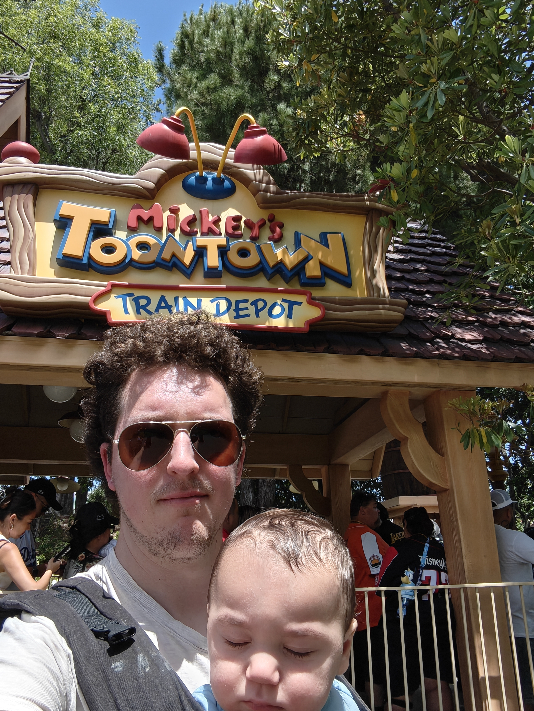
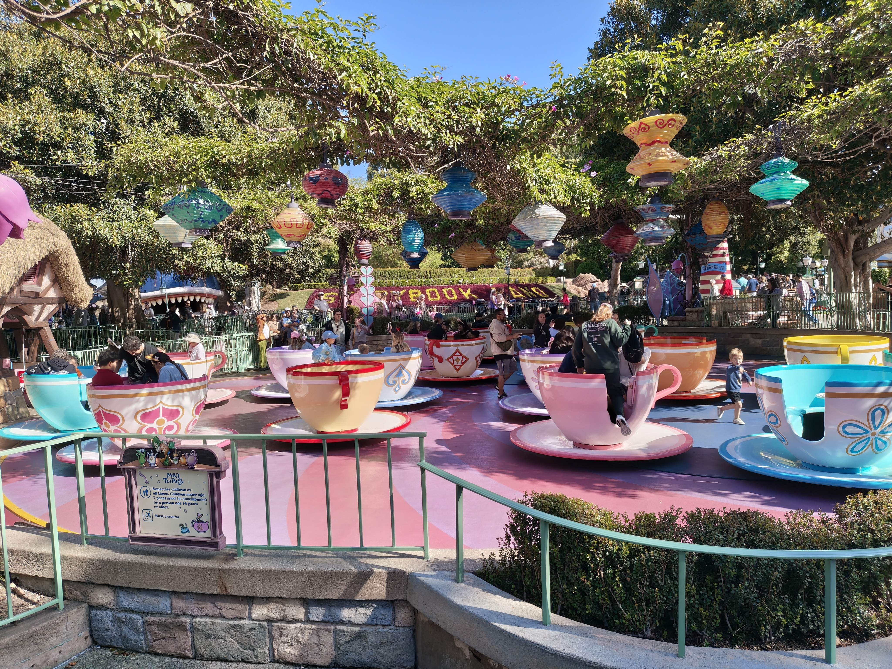
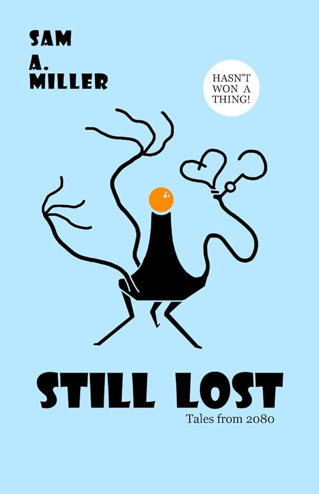
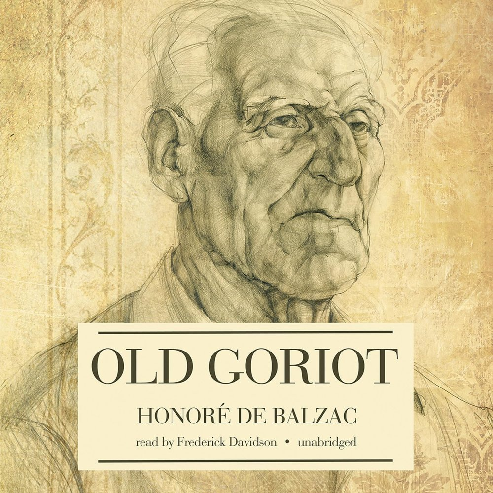

+++
title = "What's Good #19"
date = "2026-05-02"
description = "Disneyland, Ghost Brigades, Still Lost, and Old Goriot"
taxonomies.tags = ["whats-good"]
+++

# Disneyland, CA

The highlight of this month was that the whole family went to Disneyland, and California Adventure, for the first time!

I've watched dozens of hours of Defunctland, so I felt more or less qualified to go to Disney and gave a good time... it was so much more intense than the simulations prepared me for.

We went on a few rides, despite being height challenged with two < 3 year old boys.

## Pixar Hotel

We splurged and stayed in the Pixar hotel which relative to some of the other options was cheap but objectively speaking was kind of spendy. 
It was fun to stay at a themed hotel and to look for all of the little Easter eggs around and of course it was fun for my kid who loves toy story and Pixar to hunt for said Easter eggs.

## Goofy's Kitchen

This was the "Meet and Greet" restaurant experience in the main Disneyland Resort.
You start by getting photos with goofy, then when you sit at your seat you're visited by Minnie Mouse, [Clarabelle Cow](https://en.wikipedia.org/wiki/Clarabelle_Cow), and some chipmunk characters.
I am always impressed with how well the cast members play the characters and communicate without (being able to) say a word!

## Teacups

My wife regailed us with stories of riding Teacups dozens of times in a single rainy day when she was ~6, subjecting her dad to a day of torture.
My kids loved it, great first ride.

## Toon Town

I've written before about my foray into Toontown Rewritten so visiting Toontown was a must.
Obviously video game can look very whimsical and wacky so it's very impressive to see it in real life with the exact same vibes.

## Mickey & Minnie's Runaway Railway

Holy crap this was a great ride.
The way the Mickey and Minnie faces were perfectly projected onto physical objects, the way the omni-directional movement jerked you around, it was a wild ride like nothing I've ever experienced before.

## Finding Nemo Submarine Voyage

This was... interesting but as a follow-up to Runaway Railway fell flat.
At least the line was pretty short.

## Autopia

This was the longest wait of the day but totally worth it.
My toddler was able to drive a car! 
I mean obviously not on the open road, it was on a guide rail, and I controlled the gas, but you get the idea.

## Bluey's Best Day Ever!

This is a good activity to do to chill out after a very overstimulating few hours. 
The Bluey show is a live performance with music and skits and room to dance up front or plenty of seats to just sit and watch.

## Disneyland Railroad

Next we took the Disney railroad from the blue ride to Adventureland where the Jungle Cruise was.
Not only is the train cool, because you know trains are cool, but there's also a section in the middle where it becomes a dark ride going through exhibits about dinosaurs and the Grand Canyon; very neat.

## Jungle Cruise

Next we did Jungle Cruise which I think is a classic.
our cast member running the boat was very talented cracked a lot of jokes and was clearly very experienced so he was the highlight of the ride for me.

## Pirates of the Caribbean

To finish our first day we did Pirates of the Caribbean which is also a classic and also super fun. 
Especially for our almost 3 year old it was the perfect amount of scary and whimsical. 
He left the ride singing "Yo ho ho..." and saying Arrrr like a pirate.

## Toy Story Midway Mania!

For our second day we went to California adventure which is the much more pixar-themed Park which I appreciated cuz our toddler watches a lot of Pixar movies.

We went on toy story Midway mania which in some ways is like The runaway railroad in that the ride kind of goes off the rails but is more like a arcade where you go from game to game and try to rack up a high score.
Especially compared to Runaway Railroad it wasn't nearly as impressive but the game aspect was engaging.

## Norovirus

-- wait that's not a ride.

Yeah for our second day we got norovirus and we're stuck in our hotel throwing up for most of the day. 

> Fun fact that I learned: hand sanitizer does not kill norovirus; you have to wash your hands. 

---

I was a little worried that Disney would not be very fun with a almost three and almost 1 year old but there are a lot of accommodations. 
There is copious stroller parking, every restaurant accommodates kids, and the lack of cars makes it a very safe place to let your kid wander around even if you do need to maintain eyes on them because oh my God they could easily get lost in this crowd -- there's so many people where did my kid go ahhhh.

# Still Lost

Still Lost is a collection of short stories written by Sam O' Nella.
Sam is a YouTuber I've followed for many years who does funny infotainment and isn't very active recently but randomly came out with a self punished book on Amazon and my current policy is that if a creator I like does an interesting thing that's outside their wheelhouse, give it a shot.

The stories take place in a near future sci-fi world in which aliens have invaded and essentially turned Earth into a galactic nature preserve. 
That said the stories don't directly connect to that theme and range from allegories for drug use to making fun of academics.

Over all I like the quality of these stories I thought they were fun and pulpy and frankly I think they could have been published by one of the indie sci-fi publishers.

# Old Goriot

old goriot was a recommendation by man carrying thing. 
I listen to the audiobook which I borrowed from my library and really enjoyed listening to an older story which both felt like a modern novel but also a period piece -- let me explain. 
the book felt like a period piece because it was written in the early 1800s and references many events that took place at that time and parts of culture that are just different from today. 
but it also felt modern because it was written in the current ERA of the time and so people are cracking jokes and much looser than they are in our modern period piece vernacular.
does that make sense? 
like the way we write. pieces today is different from how people in those periods wrote about the common the current ERA.
I think the way we write period pieces today is much more flat than how authors of the time wrote about their current ERA similar to how when we write about our current ERA we talk about tiny details like your Starbucks order that would probably be lost if an author 200 years in the future is writing about the early 2000s. 
for example there's a scene in which one of the characters talks about dioramas and then all the characters start to add Rama to the end of words like dinner Rama and going to bed rama. it's a good bit and they refer back to it often and it's just hilarious.