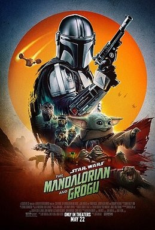

+++
title = "What's Good May 2025"
date = "2026-05-30"
description = "..."
taxonomies.tags = ["whats-good"]
+++

# PIGCON

Picture Here

I've been on the PIG Squad mailing list for a few years now.
I make games and I live in Portalnd, I don't think I need to explain further.

When [PIGCON](https://pigcon.pigsquad.com/) was announced my wife actually caught it and bought me tickets -- she's much more plugged into evens than I am.

I brought my toddler along to enjoy the floor and so I could scope out some new indie titles which was successful!

A few games that grabbed my attention:
* [Dittori](https://store.steampowered.com/app/4311980/DITTORI/), because I'm on a Sokoban kick.
* [Devil Lift](https://store.steampowered.com/app/4125380/Devil_Lift/) because I'm also on a deck-builder combat kick.
* [Line Wobbler](https://robinb.itch.io/line-wobbler) a 1-d dungeon crawler.
* [Choosatron](https://jerrytron.com/projects/choosatron/) a little box that prints the output of a text based RPG on receipt paper with little 1-4 buttons to choose actions.

I love indie games.
They are so vibrant and varied, you can enter a room of "indie games" and see everything from a straight narrative game, a sokoban puzzler, to an experimental game where you play whack-a-mole scanning RFID badges.

I didn't get to go to any talks, I hope they are recorded and posted later because a few sounded like the sort of thing I would watch even if I wasn't attending the con.

# The Mandalorian and Grogu

Don't listen to the haters.
This movie is fantastic.

It's slow and deliberate in it's pacing.
The story is great, and if you like the original Star Wars trilogy, which I do, this fits into that canon very well.

# Home Gym

Picture Here

My job provides a "health stipend" which I spent this month splurging on _way nicer exercise equipment_ than I otherwise would.

It's been nice to have a more robust weightlifting set right next to my home office, so I can take a break, lift some weights, and get back to what I was doing.
It's broken up my days really well, helped me feel better throughout the day, and I'm feeling stronger too!

I got a bench and some of those adjustable dumbbells mostly for safety, I've heard too many stories of people working out solo and getting pinned by a barbell -- I'll upgrade if I _really_ need to.

