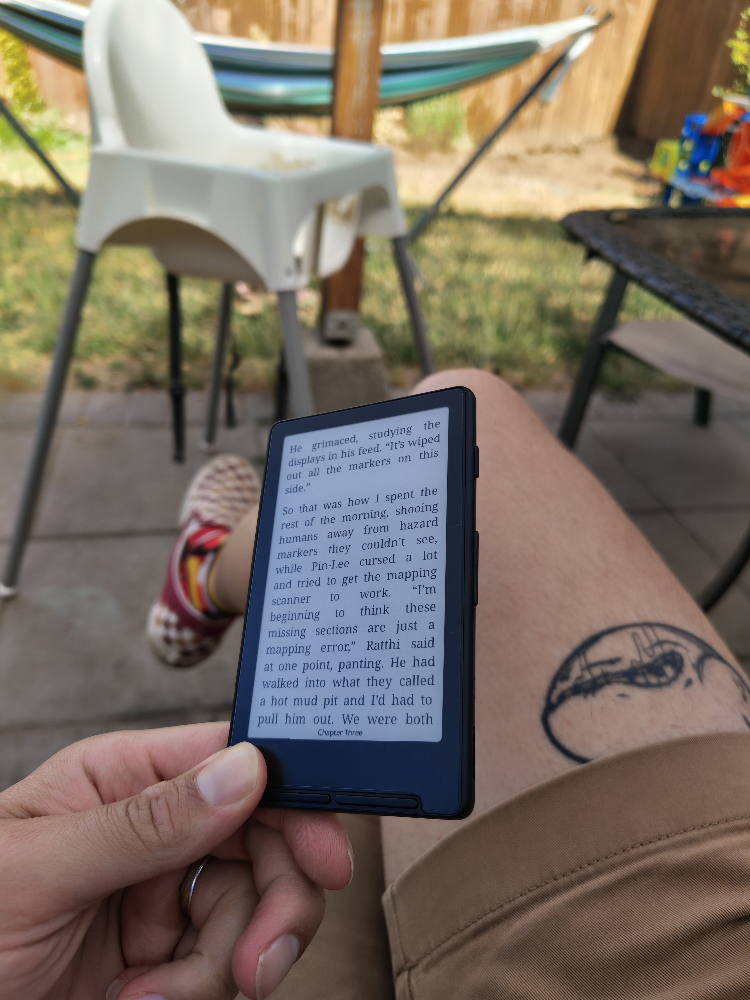

+++
title = "What's Good #20"
date = "2026-07-03"
description = "A Shed, an E-Reader, and Order of the Sinking Star"
taxonomies.tags = ["whats-good"]
+++

# shed

This post is coming out a few days late because I had to finish building a shed!

This is an external home office sheduation, so similar to an ADU but without you know... running water and electricity.

It was a kit build from Amazon weirdly enough, turns out Amazon will gladly let you send them north of $10k and in return you'll a logistics company will drop off two big ass pallets of parts for you to assemble into a shed.

I have visions of putting a solar panel on top and having it "off grid" using an chonky Anker battery I bought for when the power goes out.
I'll also need to figure out a better wifi situation because my router is in the basement and just about as far away from the shed as you can get with a few layers of wood and ventilation between it and the internet, so if you have ideas about how to solve that let me know... I suspect it'll involve a router I have in a box and OpenWRT.

# xteink4 e-reader

Besides the shedapalooza I also bought an XTEINK4 which, to put it mildly, fucking rocks -- for me.

* small e-reader with a 4.3" screen, easily fits in my pocket.
* no touch screen, physical buttons only.
* a [thriving community](https://www.readme.club) with dozens of [open source custom firmwares](https://crosspointreader.com/) easy and ready to flash.

There are of course some downsides:
* no backlight, which is one of my favorite parts of my Kindle.
* i love getting books through Libby and sending them to my Kindle over the air, that's a non-starter with this non-Kindle device.
* in general it's difficult to acquire non-DRM epubs that are compatible with this device :-(

Anyway, since buying this I've become a voracious reader.
I blasted through [All Systems Red](https://en.wikipedia.org/wiki/All_Systems_Red) and am now reading [The Complete Cosmicomics](https://en.wikipedia.org/wiki/Cosmicomics) both of which are very enjoyable.

The key I'm realizing is that especially with little kids, convenience is king for entertainment.
* Watching movies on my phone
* Playing videogames on the Steam Deck
* Reading on a little screen in my pocket

I'm able to turn it on, read the equivalent of one or two pages, and when I get interrupted -- because the kids decided they want to hang out now -- I can put it away.
I'm able to bin-pack reading into my day in a way that I just couldn't with a Kindle or even an app on my phone -- because my kids flock to the phone in a way they don't for a "boring" screen like this.

---

Pretty sparse this month, unfortunately I _started_ a few things but didn't _finish_ them; hopefully next month will be a bit more stacked as a result though.
