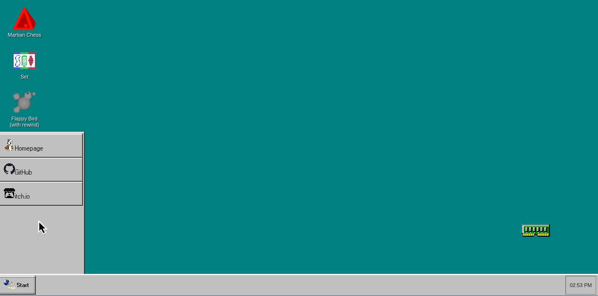

# PortfoliOS

This was a fun idea I had to make an interactive portfolio site.
The 90's Windows style is one I am especially nostalgic for, of the Good Old Days™ using the family computer in the living room.

## Resources

I used a few really useful tools in building this out:
1. [win95.css](https://alexbsoft.github.io/win95.css) covered the majority of styling.
2. [win98icons](https://win98icons.alexmeub.com/) helped with the iconography when I didn't have a good icon to work with.

All art assets (images, pros, videos) are by me, are uses of win98icons/win95.css, or are obvious modifications of existing logos.

## AI Disclosure

As stated on the site, I used Claude Code with Sonnet 4.6 for the majority of the code here.

## License

Art assets not otherwise owned by third parties (like modified logos) are licensed [CC 0 (public domain)](https://creativecommons.org/public-domain/cc0/).
